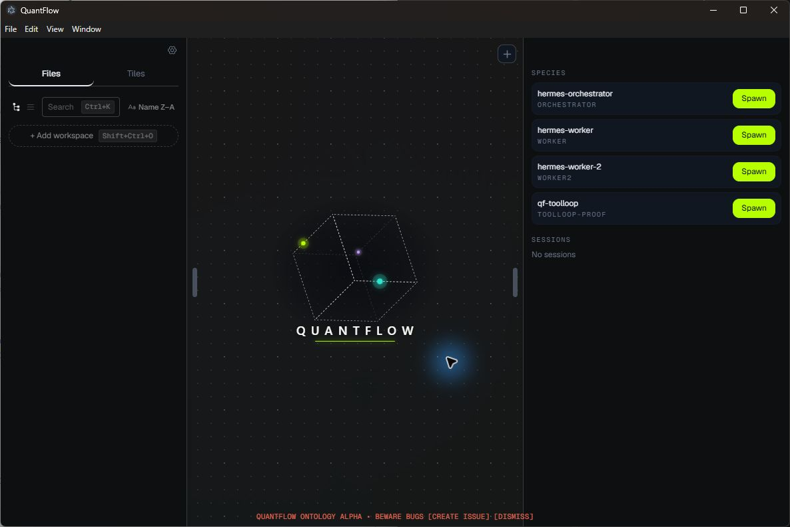
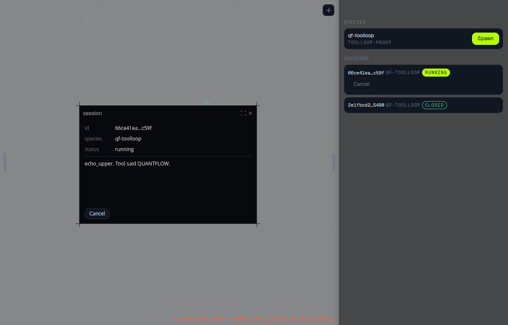
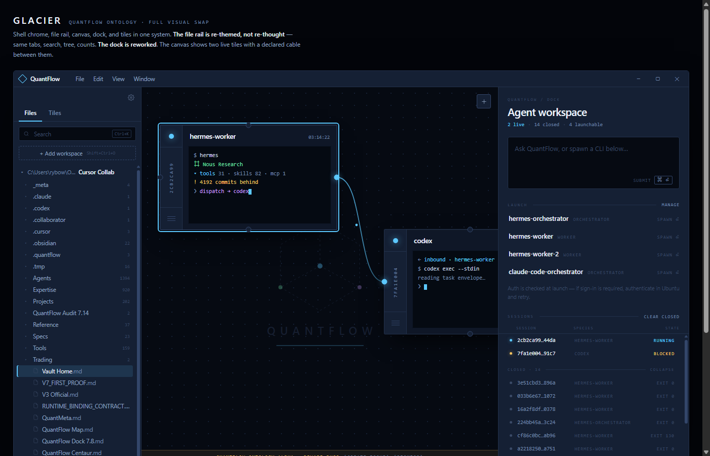
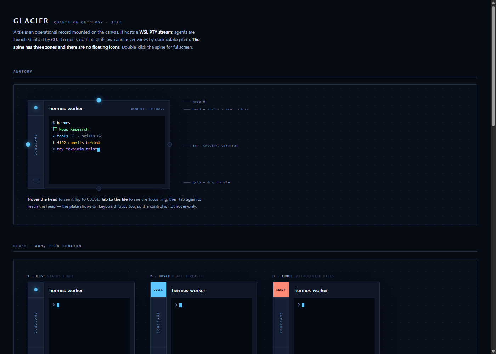

# QuantFlow Ontology

**A Windows-first, ontology-centered quantitative research and learning environment led by a custom Hermes Research Director.**

QuantFlow doesn't compete with agent frameworks — it's the surface they land on. Claude Code, Codex, Hermes, a scraper, an RL worker: any controllable CLI can become a Dock runtime through an adapter package, then appear as one or more founder-visible profiles on the canvas. Profiles keep their own identity while sharing reusable runtime code, collaborate over an MCP bus, and act on a shared, governed world model (the Kernel). New agent tools shipping across the ecosystem aren't competition here — they're inventory.

> **It plugs into your world; it doesn't become your world.**

Built solo, in the open, for native Windows first. Early-stage and honest about it — see [Status](#status).

---

## Screenshots

<p align="center">
  
</p>

<p align="center"><em>Live Windows shell (WO-WIN1 evidence): infinite canvas, file rail, and Dock — Act I product floor. Glacier (g1–g5) re-skins this surface in source; rebuild the install to see it on the desktop shortcut.</em></p>

<p align="center">
  
</p>

<p align="center"><em>A Dock-spawned <code>qf-toolloop</code> session on the canvas with live session ledger (running / closed) — collaboration transport proven on Windows.</em></p>

<p align="center">
  
</p>

<p align="center"><em>Glacier design reference (<code>design/glacier/showcase.html</code>) — the look WO-g1–g5 land in source: spine tiles, typographic dock, void canvas, and declared (dashed) cables.</em></p>

<p align="center">
  
</p>

<p align="center"><em>Tile anatomy from the Glacier tile spec — 44px spine, arm-then-confirm close, vertical session id. WO-g2 landed this structure in source.</em></p>

---

## What works today (verified, not aspirational)

Every claim below is backed by a falsified `qa/` gate, a Kernel proof, or a recorded work-order evidence folder. If it's not on this list, it doesn't exist yet.

- **The Kernel** — a sole-writer SQLite system of record. Append-only event log, content-addressed artifacts, schema-generated code (`qf-kernel-schema`). All mutation goes through Kernel `execute()`; gates fail the build if any other path writes domain truth.
- **The canvas + dock** — an infinite pan/zoom Electron surface. Every agent card launches by exact Kernel definition id. Sessions link back to the definition the founder clicked. Dock **Clear** hides closed sessions from the ledger without deleting Kernel history.
- **Agent seats** — packaged Dock includes `qf-toolloop`, Hermes profiles, and labeled deterministic proof profiles. Deterministic collaboration is proven end-to-end on Windows; model-backed seats are present with distinct Kernel identities but are not certified as everyday research workflows.
- **The peer bus** (`tools/qf-peer-bus`) — stdio MCP (`send_to_peer` / `read_inbox` / `list_peers`). Peer messages land as content-addressed `trajectory` artifacts. Transport SQLite stays separate from the Kernel.
- **Desk + governed research loop (R0–R15)** - Kernel, Dock seats, durable Tasks, Research Director recruitment and steering, strict independent critic review, and evaluation-gated Report publication are independently verified in this checkout.
- **Native Hermes development runtime** - the custom Research Director and exact least-privilege critic run through the production Hermes transport with durable Kernel identity and receipts.
- **Connection write path (WO-g5a)** — experimental `create_connection` / `delete_connection` through `execute()` only; upgrade `0006` brings existing Kernels forward.
- **Glacier visual program (WO-g1 → g5)** — tokens + ANSI (g1), tile spine (g2), dock masthead/ask/launcher/ledger (g3), shell chrome / file-rail / canvas / z-scale (g4), Kernel-backed **view** cables with dashed honesty + orphan cascade (g5). ADR-0003 allows UI on experimental `connection` without promotion. Reversible checkpoint: tag `glacier-checkpoint-a` (after g5a+g1). Installed asar needs rebuild/package-click to match source.
- **Verification culture** — work orders, cold worktrees, bait-tested gates. Artifact hashes are recomputed, not trusted.

## The end goal: a governed research and learning world

**QuantFlow is a Windows-first, single-user, ontology-centered quantitative research and learning environment.** Its default front door is **Research Director**, a custom Hermes Agent Profile. Ryan states a research mission naturally; the Director uses governed Kernel actions to plan, recruit exact specialists, assign work, and route evidence. The canvas automatically reveals that active work and lets Ryan steer it. The Dock is optional manual inventory and control. Quantitative research is the invariant domain, sports betting is the first application, and QuantFlow never places a bet or trade.

1. **One governed system of record.** The Kernel is the sole writer. Retrieval, scraping, and agent chatter never become truth without passing through a Kernel command.
2. **Tools follow the ontology.** Model the object/link/action graph correctly and CRUD + action tools fall out of codegen for free — that's what lets agents one-shot cross-object work instead of being hand-held verb by verb.
3. **Names and descriptions are load-bearing.** Agents reason over the schema. Every object type and property carries a mandatory description, enforced by lint, or it doesn't merge.

The ontology has three planes:

- **Research plane** (invariant, market-agnostic): `Hypothesis → Dataset → Run → Artifact → Evaluation → Report`. Identical whether the instrument is a game line, a perp contract, or an equity.
- **Market plane** (pluggable, pipeline-fed): `Venue / Instrument / Quote / MarketEvent`. A new market adds *rows*, never new object types.
- **Agent plane** (largely live already): `AgentDefinition` (Dock profile) → `AgentSession` through `spawned_from`, plus trajectory artifacts. Several definitions may share one runtime package without collapsing identity.

**The proof standard** — the day this repo gets to call itself an ontology: an orchestrator seat answers *"What did the last Run on Hypothesis X show, which Evaluation gated it, and should we re-run against the newer Dataset?"* in one pass, using only tools generated from the schema, with every step recorded to the Kernel.

## Status

**As of 2026-08-22 (this checkout). If this table disagrees with `NEXT.md`, `NEXT.md` wins.**

| Layer | State |
| --- | --- |
| Build authority | [`docs/orders/NEXT.md`](docs/orders/NEXT.md) records an alignment pause: R17 is accepted, [`docs/orders/WO-R18.md`](docs/orders/WO-R18.md) is draft-only, and no Builder is authorized |
| Product plan | [`docs/proposals/V2-SCOPE.md`](docs/proposals/V2-SCOPE.md) — non-authoritative source record; route authority remains [`docs/orders/GOLDEN-RUN.md`](docs/orders/GOLDEN-RUN.md) and build authority remains [`docs/orders/NEXT.md`](docs/orders/NEXT.md) |
| Golden route | [`docs/orders/GOLDEN-RUN.md`](docs/orders/GOLDEN-RUN.md) — R17 named Technique/outcome grading is complete; R18 evaluated recall is the next alignment door |
| Product floor | Installable Windows app, one Hermes Research Director, governed specialist Tasks and steering, exact critic review, evaluation-gated publication, and a pointer-inspectable 13-object/15-cable Mission-to-Report world that survives reopen |
| Honest boundary | Named Technique-bound forward research now works and missing-Technique admission refuses before write. Evaluated recall, governed PufferLib learning, and trace-driven improvement remain R18 to R20. |

```bash
bun qa/run.ts rung-ladder    # must say active=R18; NEXT keeps Builder authority closed during alignment
bun qa/run.ts --list         # every registered gate
```

Do not treat `bun qa/verify-release.ts` as everyday proof. It is a release door, not the next feature.

The ontology is generated, not hand-written: object types, links, actions, the migration, the agent tool surface, and the conformance suite all fall out of one schema. The live surface is [`qf-kernel-schema/golden/ONTOLOGY.md`](qf-kernel-schema/golden/ONTOLOGY.md), regenerated by `bun run generate` and compared byte-for-byte on every schema test run.

Research-only: QuantFlow **never places bets or executes trades**. It proposes, backtests, criticizes, evaluates, and reports — the operator acts in the world.

## Architecture

Non-authoritative [Product brief](docs/PRODUCT.md); `START_HERE.md` remains the authority.

```
┌───────────────────────────────────────────────────────┐
│  CANVAS + DOCK (Electron)          the surface        │
│  seat spawn rail · terminal tiles · live PTY sessions │
├───────────────────────────────────────────────────────┤
│  COLLABORATION PLANE               agent ↔ agent      │
│  qf-peer-bus (stdio MCP) · host push into live TUIs   │
├───────────────────────────────────────────────────────┤
│  WORLD MODEL                       agent ↔ world      │
│  SQLite Kernel · sole writer · append-only event log  │
│  content-addressed artifacts · schema-generated code  │
└───────────────────────────────────────────────────────┘
```

Runtime split worth knowing: the Electron main process is Node (`node:sqlite`); Bun code (tools, tests, gates) uses `bun:sqlite`. The Kernel is opened through a single driver seam — only one file in the app may import it, and a gate enforces that.

## Repo layout

| Path | What it is |
|---|---|
| `collab-electron/` | The desktop app — canvas, dock, seat spawning, peer delivery watcher |
| `qf-kernel-schema/` | Schema → generated Kernel SQL, tools, ontology docs, upgrades |
| `tools/qf-peer-bus/` | The MCP peer bus: server, transport db, Kernel recording, cold-harness proofs |
| `species/` | Runtime/adapter packages and agent fixtures; durable Dock profile identity lives in the Kernel |
| `design/glacier/` | Glacier visual language — tokens, tile/showcase specs, cable plumbing |
| `qa/` | Gates. Falsifiable by construction — if a gate can't go red, it isn't a gate |
| `docs/orders/` | Work orders + verification records (the build's audit trail) |
| `docs/readme-assets/` | Screenshots linked from this README |

## Development

Prerequisites: **Windows 11**, **Node.js 24+**, and **Bun**. Native Windows packaging and runtime are the release floor; WSL/Linux are secondary compatibility targets.

```sh
git clone <this repo>
cd QuantFlow-Ontology/collab-electron
bun install
bun run dev     # Electron app with hot reload
bun test        # tests
bun run build   # production build
```

On Windows, `bun run package:unsigned` creates the unsigned package under `collab-electron/dist/`.
The canonical readiness check is run from the repository root with `bun qa/verify-release.ts`.
While the app is running, `qf-canvas` is the command-line control surface for arranging and
inspecting canvas tiles.

Cold-start for agents: read [`START_HERE.md`](START_HERE.md), then [`AGENTS.md`](AGENTS.md), then the order named by `docs/orders/NEXT.md`.

### Local data layout

QuantFlow keeps domain truth, durable artifact bytes, and app-local projection state in three
deliberately separate locations:

```text
~/.quantflow/kernel.db
~/.quantflow/artifacts/
~/.quantflow/app/
```

The Kernel is the sole source of domain truth. Artifact bytes live beside it under the canonical
artifact root, while canvas, browser, configuration, logs, sockets, and other app-local state live
under `app/` (development launches are isolated below `app/dev/worktree-<id>/`). On first launch,
QuantFlow copies eligible state from the legacy Collaborator locations without deleting the source;
if both roots exist, the QuantFlow root wins unchanged.

Gates run from `qa/` and are wired into CI. The Dock definitions bootstrap automatically from packaged manifests, but real Hermes turns still require the founder's local [Hermes](https://github.com/NousResearch/hermes-agent) install and matching `qf-orchestrator`, `qf-worker`, and `qf-worker-2` runtime profiles. The founder-only peer-bus helper is `tools/qf-peer-bus/scripts/setup-founder-seats.ts`.

**Current collaboration limit:** Windows proofs cover catalogue selection, session lineage, safe native-TUI cleanup, and metadata-authorized PTY delivery for deterministic seats. They do not create Hermes profiles, handle credentials, or prove an unscripted real-model research collaboration; those remain later rungs.

## Doctrine (the rules this repo is built under)

- **Stop building engines.** The substrate is done. New effort goes into the world model and the loop that runs over it.
- **Kernel is the sole writer.** Everything else asks.
- **One canonical type per real-world entity.** `Run` with a `kind` property — never `BacktestRun`/`ScreenerRun` clones. Extension via new linked types, not mutation of shipped ones.
- **Pipeline-shaped data has no per-type or manual agent write verbs.** Trusted bulk-ingest commands still pass through the Kernel's single `execute()` door, carrying provenance and atomic retry rules, while Dock agents receive read access rather than a second write surface.
- **Descriptions are enforced, not encouraged.** The schema is agent context.
- **Measurements beat prose.** Nothing is "done" by narrative — gates go red or the claim doesn't exist.

## Lineage

QuantFlow is a fork of [Collaborator](https://github.com/collaborator-ai/collab-public) (`collab-electron`), whose canvas, tile system, and terminal architecture form the surface layer — see `LICENSE.md` and `NOTICE.md`. The Kernel, peer bus, seats, gates, and the ontology direction are QuantFlow's own.

## License

See [LICENSE.md](LICENSE.md).
