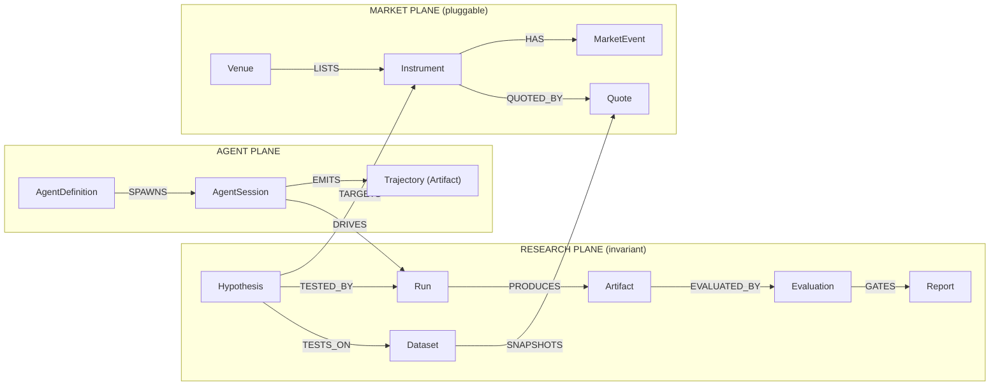

# QuantFlow — The Ontology Doctrine

> How to build a Palantir-grade ontology as a solo developer — market-agnostic, trading-focused, with tools anyone can install.

## The verdict, up front

**You are closer than you think, and behind where you think.** A Palantir ontology is four primitives — object types, properties, links, actions — held together by three disciplines: a single governed system of record, a tool surface *generated from* the schema, and names/descriptions treated as load-bearing agent context. QuantFlow already has the hardest of the three: a sole-writer Kernel with an append-only event log and content-addressed artifacts, gate-enforced. That's the part enterprises take years to accept, and it's running on your machine.

What you don't have is the ontology itself — the charter of ~14 named, described, linked object types — and the generated tool plane that falls out of it. That is not months of engine work. It is roughly **one week of modeling and two weeks of codegen**, on top of a collaboration plane you proved working this week. The months were lost rebuilding engines, not because the goal was too big. Stop building engines. Write the charter, generate the tools, and let the agents you already wired do research over it.

---

## Part I — What a Palantir ontology actually is (stripped of the paywall)

Strip away Foundry's branding and the ontology is a small grammar plus a set of disciplines. None of it is secret; none of it requires their platform. Their own DevCon6 talks describe it plainly.

### The four primitives
- **Object types** — the real-world nouns of the business (*not* mirrors of source tables). One canonical type per real entity.
- **Properties** — typed fields, every one described, pipeline-noise excluded ("no business value" columns stay out).
- **Links** — pre-wired relationships. The piece that makes agents reliable: *"having it all modeled… lets us get a lot closer to one-shotting these analyses."*
- **Actions** — the governed verbs. All mutation goes through them; nothing writes to the store directly.

### The three disciplines that make it "real"
1. **One governed system of record.** A single truth layer, mutated only through actions, with lineage. The cultural mountain for enterprises; a solved problem for you — the Kernel is the sole writer, enforced by falsified `qa/` gates.
2. **Tools follow the ontology, not the reverse.** Palantir didn't hand-craft 20 MCP tools. They modeled the object/link/action graph correctly and generic CRUD + action tools fell out for free. That's why their agents chained retrospective → plan → publish → dependency-query without hand-holding. (See [[08 - Ontology MCP]].)
3. **Names and descriptions are agent context.** *"These LLMs were not trained on your enterprise's data"* — the schema is the grounding an agent reasons over. Misnomer is "one of the worst anti-patterns." (See [[09 - Ontology Governance]].)

### The proof standard
An ontology is *real* the day an agent performs cross-object synthesis through generated tools in one shot. QuantFlow's equivalent proof, fixed now:

> An orchestrator seat is asked: "What did the last Run on Hypothesis X show, which Evaluation gated it, and should we re-run against the newer Dataset?" — and answers correctly using only tools generated from the schema, in one pass, with every step recorded to the Kernel.
> — *the QuantFlow one-shot test (Phase 4 exit gate)*

### The honest part about the last few months
Time wasn't lost because the goal was too big. It was **layer confusion** — rebuilding engines (harness, canvas, runtime plumbing) already good enough, while the world model they exist to serve stayed empty. The dock/canvas of heterogeneous agents is the differentiator nothing else ships, and this week the collaboration plane through it became *real* (peer bus + PTY delivery, verified). The missing organ was never another engine. It's the shared world the agents act on. That's the ontology — Part IV.

---

## Part II — What QuantFlow already has (audited inventory)

Mapped against the six-layer agent stack Palantir launched at DevCon6. Status is verified repo state, not docs.

| Palantir layer | QuantFlow equivalent | Status |
|---|---|---|
| **Ontology** | SQLite Kernel — sole writer, append-only log, content-addressed artifacts, schema-gen code | SUBSTRATE **HAVE** / CHARTER **GAP** |
| **Ontology MCP (OMCP)** | qf-peer-bus proves the MCP plane + Kernel recording; `qf_*` verbs hand-grown, not generated | **SEED** |
| **Agent Engine** | Hermes seats (orchestrator/worker/worker2) — BYO harness, the pattern Palantir supports | **HAVE · PROVEN** |
| **Orchestrator** | Event log gives replayability; no durable suspend/retry yet (Effect is the candidate) | **PARTIAL** |
| **Agent SDK / Builder** | qf-kernel-schema codegen (schema → typed code) — the OSDK move | **HAVE** |
| **Agent Manager** | Canvas + dock + agent.log + trajectory artifacts. Palantir *retreated* from their graph view; you ship it | **HAVE · DIFFERENTIATOR** |
| **AIP Evolve** | Future: Evaluation history as fitness (backtest metrics beat LLM-as-judge) | **LATER** |
| **Workshop / frontend** | Electron canvas — spatial, operator-grade, renders live seats | **HAVE** |
| **Two-layer permissioning** | Transport read/write separation only; category deny-list is a future steal | **LATER** |

**Read honestly:** five of nine layers are HAVE, and one HAVE (the canvas) is something Palantir explicitly walked away from. The two gaps that matter — the charter and the generated tool plane — are the cheapest rows on the board.

### Also banked this week
- **Real agent-to-agent collaboration** — orchestrator → worker peer message into a live TUI, auto-processed, replied via `send_to_peer`, both legs recorded as content-addressed trajectory artifacts. The multi-month blocker; done and verified.
- **Verification culture** — falsified gates (bait → red → restore → green), cold worktree verification, provenance recomputation. This *is* governance.
- **Trajectory store** — every peer message is already a distilled, structured artifact: the "distill-then-embed" shape the recall layer will want. (See [[Cerebras Knowledge Base - Retrieval Layer Notes]].)

---

## Part III — The replication kit (every Foundry organ, solo-dev edition)

Nothing here is behind a paywall, a free-tier cap, or a contract. Most is already in your repo.

| Foundry component | Palantir's ideology | Solo-dev tool | Status |
|---|---|---|---|
| Ontology object store | One governed truth layer | SQLite (`bun:sqlite`/`node:sqlite`) — the Kernel. Owned, no rate limits, sub-ms | **HAVE** |
| Ontology-as-code (`ontology.mts`) | Objects/links/actions as TS; live regen; drift = lint error | A TypeScript charter module; qf-kernel-schema regenerates typed code; drift lint | **PHASE 1** |
| OSDK codegen | Schema change → SDK regen → type errors in dependents | qf-kernel-schema already codegens — extend it to emit tool defs | **HAVE (EXTEND)** |
| Actions / write-back | All mutation through governed actions | Kernel commands via `execute()` over the event log — already gate-enforced | **HAVE** |
| OMCP server | One MCP server over the graph; tools derived; client-agnostic | `@modelcontextprotocol/sdk` — the stack qf-peer-bus ships on. Generate read+action tools from the charter | **PHASE 2** |
| Pipelines | Source data flows in via pipelines, never manual actions | Bun scripts + cron writing through Kernel commands with ingest trace | **PHASE 3** |
| Workshop / OSDK apps | Human surfaces over the ontology | Electron canvas + dock — superior for your operator | **HAVE** |
| Agent Engine + harnesses | BYO harness today; Agent SDK "coming soon" | Hermes seats + any MCP agent. Model-agnostic | **HAVE · PROVEN** |
| Orchestrator (durable exec) | Durable ledger, replay w/ idempotency, zero-cost suspend | Event-log replay now; **Effect** when Runs get long-horizon | **PHASE 4+** |
| Agent Manager telemetry | Zero-config observability; time attribution before optimization | agent.log + trajectories + canvas; add span timing when live | **PARTIAL** |
| Recall / knowledge layer | (Cerebras) distill-then-embed, hybrid retrieval, RRF fusion | SQLite `FTS5` + `sqlite-vec`, RRF k=60, age decay. Trajectories already distilled | **PHASE 5** |
| Two-layer permissioning | User-scoped token + marking deny-list | Category deny-list in the generated MCP server, when an external agent first touches | **PHASE 5** |
| AIP Evolve | Bounded experiment search over models/configs | Evaluation history as fitness (Sharpe/drawdown/hit-rate — objective) | **PHASE 6** |
| Multi-tenant ACLs, marketplace, fleet | Enterprise machinery | Not your problem — skip deliberately | **SKIP** |

### The 50-object cap, revisited
Palantir's own governance talk implies a well-modeled ontology is *small* — God Objects and type-per-system silos are what bloat counts. The Part IV charter needs **~14 object types**. The cap was never your real constraint; **ownership and real-time were** — both solved by staying local. Your own research verdict from [[00 - The Integration Question]]: *borrow the doctrine, don't build on the platform* — availability fails decisively; there is nothing to `npm install`.

---

## Part IV — The QuantFlow ontology charter (v1 proposal)

DDD in Palantir's ordering: understand the domain → design the ontology → map source data. Never the reverse. The domain is **quantitative research** — not football, not HyperLiquid. Markets plug in as data; the research loop is invariant. That's how you stay market-agnostic without being empty.

### Two planes, one agent layer
- **RESEARCH PLANE** — the invariant loop. Identical for a football spread, a perp, an equity. The spine.
- **MARKET PLANE** — pluggable per domain, fed by pipelines only. New market = new *rows*, not object types.
- **AGENT PLANE** — who does the work. Largely real in the Kernel already.



### The object types (~14, each with a mandatory description)

| Plane | Object type | What it is (the description agents read) | Key links |
|---|---|---|---|
| R | `Hypothesis` | A falsifiable claim about market behavior, success criteria declared before any Run | TARGETS Instrument · TESTS_ON Dataset |
| R | `Dataset` | A point-in-time-fenced snapshot of market data a Run may read. Immutable once fenced | SNAPSHOTS Quote/MarketEvent |
| R | `Run` | **One canonical type.** Execution of a Hypothesis against a Dataset. Backtest vs screen vs sim is a *property*, never a subtype | TESTED_BY←Hypothesis · PRODUCES Artifact · DRIVEN_BY AgentSession |
| R | `Artifact` | Content-addressed output — trajectory, result table, chart, report body. Already live | PRODUCED_BY Run · EVALUATED_BY Evaluation |
| R | `Evaluation` | A Critic's scored judgment of an Artifact vs the Hypothesis's criteria. Gates publication | GATES Report |
| R | `Report` | The publishable synthesis. Cannot exist without a passing Evaluation — enforced | DERIVED_FROM Artifact |
| R | `Mission` | Workspace-level intent: the standing questions this desk works. Scopes search/recall | CONTAINS Hypothesis |
| A | `AgentDefinition` | A species: harness, model, profile, tool grants. Already Kernel rows | SPAWNS AgentSession |
| A | `AgentSession` | A live seat on the canvas. Owns trajectories it emits | DRIVES Run · EMITS Artifact |
| M | `Venue` | Where instruments trade/are quoted: a sportsbook, an exchange | LISTS Instrument |
| M | `Instrument` | A tradeable/betable thing: a game line, a perp, a ticker. The market-agnostic pivot | QUOTED_BY Quote · HAS MarketEvent |
| M | `Quote` | A priced observation at a timestamp: odds, bid/ask, close. Pipeline-fed only | OF Instrument |
| M | `MarketEvent` | A discrete occurrence: kickoff, injury news, funding event, settlement | ON Instrument |
| M | `Position` | *(Later — only when real capital exists.)* An actual stake on an Instrument per a Report | JUSTIFIED_BY Report |

### Actions (governed verbs — deliberately few)
Coherent verbs, not property-level sprawl. Pipeline-shaped data (quotes, events) gets **no** action — the Golden Hammer rule.

`propose_hypothesis` · `fence_dataset` · `start_run` / `complete_run` · `publish_artifact` (exists) · `record_evaluation` · `publish_report` (rejects without passing Evaluation) · `register_instrument`

### The charter as code (Phase 1's deliverable)

```ts
// ontology/research.ts — the charter is a module, not a document.
// Every type and property carries a description: agents read these.
defineObjectType({
  apiName: "Run",
  description: "One execution of a Hypothesis against a fenced Dataset. " +
               "Kind (backtest|screen|simulation) is a property — never a subtype.",
  status: "experimental",        // lifecycle: experimental → active
  properties: {
    kind:      { type: "enum", values: ["backtest","screen","simulation"],
                 description: "Execution mode; differentiates by composition, not type" },
    startedAt: { type: "timestamp", description: "Wall-clock start" },
    status:    { type: "enum", values: ["running","complete","failed"],
                 description: "Reported by the execution environment, never set by hand" },
  },
  links: {
    hypothesis: { to: "Hypothesis",   kind: "TESTED_BY",  description: "The claim under test" },
    dataset:    { to: "Dataset",      kind: "READS",      description: "Fenced data snapshot" },
    artifacts:  { to: "Artifact",     kind: "PRODUCES",   many: true },
    session:    { to: "AgentSession", kind: "DRIVEN_BY",  description: "The seat that ran it" },
  },
  actions: {
    start_run:    { description: "Begin executing a Hypothesis against a Dataset" },
    complete_run: { description: "Record terminal status + final artifacts" },
  },
});
// From this one module, codegen emits: SQL DDL → Kernel · typed TS client →
// seats · MCP read tools (get/search/traverse) + action tools → the qf server.
// Change the schema, everything regenerates, drift becomes a type error.
```

That last comment is Palantir's SuperRepo demo (local embedded ontology, live-regenerating OSDK, schema-drift-as-lint) reproduced with your existing codegen + Bun monorepo. Their version needs a Foundry contract. Yours needs a week. (See [[05 - DevX SuperRepo & Agent Development]].)

---

## Part V — The roadmap (six phases, each with a falsifiable gate)

No phase is "done" by prose. Each has an exit gate that can go red.

### Phase 0 — The substrate · **BANKED**
Sole-writer Kernel + event log + content-addressed artifacts. Peer bus with Kernel-recorded trajectories. PTY delivery — live, verified agent collaboration in native TUIs. Canvas + dock. Falsified gate culture. **Do not rebuild any of this. It is finished.**

### Phase 1 — The charter · **WEEK 1**
Write `ontology/` as code: the ~14 types of Part IV, every type/property described, links + actions declared, lifecycle flag on every type. A modeling week, not an engineering month — most shapes already exist informally in the Kernel; you are naming and governing them.
> **Exit gate:** schema lint goes red on a missing description, a subtype-of-Run clone, or a property removed from a non-experimental type. Falsified with a bait commit before it counts.

### Phase 2 — The generated tool plane · **WEEKS 2–3**
Extend qf-kernel-schema codegen to emit the MCP server: per-type read tools (`get / search / traverse-links`) and per-action write tools, from the charter, on the `@modelcontextprotocol/sdk` stack qf-peer-bus proved. Retire hand-grown `qf_*` verbs as generated equivalents land. Peer bus stays as the agent↔agent plane; this is the agent↔world plane beside it.
> **Exit gate:** add a brand-new object type → its tools appear with zero hand-written tool code, and a Hermes seat lists and calls them cold.

### Phase 3 — The first market plane · **WEEK 4**
One pipeline, one source, one market — odds or HyperLiquid, your call, the ontology doesn't care. A Bun script on cron writing `Instrument / Quote / MarketEvent` through Kernel commands with an ingest trace. No actions for pipeline-shaped data. The moment the canvas stops being an empty engine.
> **Exit gate:** every market row traces to an ingest event (provenance recomputable), and a seat answers a cross-object question about real data through generated tools only.

### Phase 4 — The defining loop, agent-run · **WEEKS 5–8**
Orchestrator + workers execute the full loop over the peer bus: `Hypothesis → Dataset → Run → Artifact → Evaluation → Report`, every step a Kernel action, every conversation a trajectory artifact. Evaluation gates Report publication mechanically. Add Effect-typed retries where Runs get long.
> **Exit gate:** the one-shot test from Part I, answered correctly, one pass, tools-only, fully recorded. **This is the day QuantFlow is a real ontology.**

### Phase 5 — Recall + trust boundaries · **MONTHS 2–3**
The Cerebras layer: `FTS5 + sqlite-vec`, hybrid retrieval fused with RRF (k=60), age decay, Mission-scoped search. Trajectories are already the distilled shape — never embed raw transcripts. Rule stays absolute: *retrieval never becomes truth without a Kernel command.* First external/cloud agent triggers the marking-style category deny-list.
> **Exit gate:** a seat's answer cites retrieved Reports/Evaluations with artifact hashes; a deny-listed category provably never crosses the MCP boundary (bait-tested).

### Phase 6 — Evolve-shaped optimization · **LATER**
Evaluation history becomes a fitness function: which strategies/models/configs produce passing Evaluations. Backtest metrics are an objective fitness signal LLM-as-judge shops would kill for. Also the finetuning substrate — the trajectory store is training data for your own next-gen agents.
> **Exit gate:** deferred until Phase 4 has months of Evaluation history. Measure before optimizing.

---

## Part VI — Governance of one (anti-patterns as lint rules)

No review board, so governance lives in `qa/` gates — the falsified-gate culture aimed at the schema.

| Palantir anti-pattern | How it appears in QuantFlow | The gate that blocks it |
|---|---|---|
| **God Object** | `Run` absorbing every tool's raw log fields | Property-count ceiling + "no ETL noise" review on charter diffs |
| **Kitchen Sink** | Mapping every scraper column 1:1 into `Quote` | Properties require a description stating business meaning — no meaning, no property |
| **Silos** | `BacktestRun`/`ScreenerRun`/`SimRun` as separate types; a type per sportsbook | Lint: no type name may embed another type's kind enum; new Venue = row, not type |
| **Action Sprawl** | `update_run_status` + `update_run_cost` + `update_run_timing` | One coherent `complete_run`; action count reviewed per type |
| **Golden Hammer** | A write-action for quotes a pipeline should feed | Market-plane types declare `pipelineFed: true` → codegen emits no write tools |
| **Misnomer** | "Item", "Data", "Thing" — names agents can't reason over | Non-empty description lint on every type and property |

- **Extend, don't mutate:** `status: "experimental" | "active"` on every type. A diff that removes/retypes a property on an *active* type fails CI; capability added via new linked types. Your schema-diff gate + changelog fills a gap Palantir left open.
- **Descriptions are enforced, not encouraged** — your own agents read this schema exactly the way AIP's do.

---

## Part VII — The claims ladder (what you can say, and when)

Pivoting marketing to "ontology" means backing it up. Never claim ahead of what a cold verifier could confirm.

- **TODAY:** *"An agent-collaboration platform with a governed system of record."* Every agent message is a typed, content-addressed artifact in an append-only log; heterogeneous agents collaborate in native TUIs on one canvas. All verified this week.
- **AFTER P1–P2:** *"An ontology-defined platform: the agents' tool surface is generated from the schema."* The load-bearing Palantir claim — tools follow the ontology.
- **AFTER P3–P4:** *"AI agents doing end-to-end quantitative research over a governed ontology."* The OMCP-demo equivalent, with the one-shot proof recorded in the Kernel. This is the demo video. This is the pitch.
- **NEVER:** Palantir affiliation/comparison-by-name in marketing · scale/fleet claims · "enterprise permissioning" before Phase 5 · any claim a bait test hasn't survived.

### The course correction, in three sentences
1. Stop building engines — the substrate, canvas, and collaboration plane are done and verified; every additional engine week is the gutter.
2. Spend one week writing the charter and two generating the tool plane — that's the entire distance between "QuantFlow" and "QuantFlow, an ontology."
3. Then run the defining loop on one real market and let the recorded one-shot proof be your marketing, because a Palantir-grade ontology isn't a feature list — it's the moment an agent does real cross-object work through tools that fell out of your schema.

---

## Sources
- [[00 - The Integration Question]] — verdict: borrow doctrine, don't build on platform
- [[05 - DevX SuperRepo & Agent Development]] — local embedded ontology, ontology-as-code, schema-drift-as-lint, worktrees
- [[08 - Ontology MCP]] — tools follow the ontology; one server over the graph; two-layer permissioning
- [[09 - Ontology Governance]] — DDD ordering; six anti-patterns; extend-don't-mutate; descriptions as agent grounding
- [[Cerebras Knowledge Base - Retrieval Layer Notes]] — record vs recall; distill-then-embed; RRF k=60
- [[INSPIRE-USECASES]] — the defining loop; three-things-first; Effect, Ragas, WrenAI candidates
- Repo audit (this week) — peer bus + PTY delivery verified; gate falsification records; trajectory artifacts live

Related: [[QuantFlow Ontology Schema v0]] · [[QuantFlow Rebuild Blueprint]] · [[QuantFlow Hub]]
