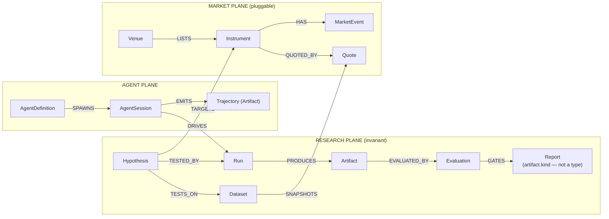

# QuantFlow — The Ontology Doctrine

> How to build a Palantir-grade ontology as a solo developer — market-agnostic, trading-focused, with tools anyone can install.

## The verdict, up front

**You are closer than you think, and behind where you think.** A Palantir ontology is four primitives — object types, properties, links, actions — held together by three disciplines: a single governed system of record, a tool surface *generated from* the schema, and names/descriptions treated as load-bearing agent context. QuantFlow already has the hardest of the three: a sole-writer Kernel with an append-only event log and content-addressed artifacts, gate-enforced. That's the part enterprises take years to accept, and it's running on your machine.

What you don't have is the ontology itself — the charter of ~14 named, described, linked object types — and the generated tool plane that falls out of it. That is not months of engine work. It is roughly **one week of modeling and two weeks of codegen**, on top of a collaboration plane you proved working this week. The months were lost rebuilding engines, not because the goal was too big. Stop building engines. Write the charter, generate the tools, and let the agents you already wired do research over it.

---

## Part I — What a Palantir ontology actually is (stripped of the paywall)

Strip away Foundry's branding and the ontology is a small grammar plus a set of disciplines. None of it is secret; none of it requires their platform. Their own DevCon6 talks describe it plainly.

### The four primitives
- **Object types** — the real-world nouns of the business (*not* mirrors of source tables). One canonical type per real entity.
- **Properties** — typed fields, every one described, pipeline-noise excluded ("no business value" columns stay out).
- **Links** — pre-wired relationships. The piece that makes agents reliable: *"having it all modeled… lets us get a lot closer to one-shotting these analyses."*
- **Actions** — the governed verbs. All mutation goes through them; nothing writes to the store directly.

### The three disciplines that make it "real"
1. **One governed system of record.** A single truth layer, mutated only through actions, with lineage. The cultural mountain for enterprises; a solved problem for you — the Kernel is the sole writer, enforced by falsified `qa/` gates.
2. **Tools follow the ontology, not the reverse.** Palantir didn't hand-craft 20 MCP tools. They modeled the object/link/action graph correctly and generic CRUD + action tools fell out for free. That's why their agents chained retrospective → plan → publish → dependency-query without hand-holding. (See [[08 - Ontology MCP]].)
3. **Names and descriptions are agent context.** *"These LLMs were not trained on your enterprise's data"* — the schema is the grounding an agent reasons over. Misnomer is "one of the worst anti-patterns." (See [[09 - Ontology Governance]].)

### The proof standard
An ontology is *real* the day an agent performs cross-object synthesis through generated tools in one shot. QuantFlow's equivalent proof, fixed now:

> An orchestrator seat is asked: "What did the last Run on Hypothesis X show, which Evaluation gated it, and should we re-run against the newer Dataset?" — and answers correctly using only tools generated from the schema, in one pass, with every step recorded to the Kernel.
> — *the QuantFlow one-shot test (Phase 4 exit gate)*

### The honest part about the last few months
Time wasn't lost because the goal was too big. It was **layer confusion** — rebuilding engines (harness, canvas, runtime plumbing) already good enough, while the world model they exist to serve stayed empty. The dock/canvas of heterogeneous agents is the differentiator nothing else ships, and this week the collaboration plane through it became *real* (peer bus + PTY delivery, verified). The missing organ was never another engine. It's the shared world the agents act on. That's the ontology — Part IV.

---

## Part II — What QuantFlow already has (audited inventory)

Mapped against the six-layer agent stack Palantir launched at DevCon6. Status is verified repo state, not docs.

| Palantir layer | QuantFlow equivalent | Status |
|---|---|---|
| **Ontology** | SQLite Kernel — sole writer, append-only log, content-addressed artifacts, schema-gen code | SUBSTRATE **HAVE** / CHARTER **GAP** |
| **Ontology MCP (OMCP)** | qf-peer-bus proves the MCP plane + Kernel recording; `qf_*` verbs hand-grown, not generated | **SEED** |
| **Agent Engine** | Hermes seats (orchestrator/worker/worker2) — BYO harness, the pattern Palantir supports | **HAVE · PROVEN** |
| **Orchestrator** | Event log gives replayability; no durable suspend/retry yet (Effect is the candidate) | **PARTIAL** |
| **Agent SDK / Builder** | qf-kernel-schema codegen (schema → typed code) — the OSDK move | **HAVE** |
| **Agent Manager** | Canvas + dock + agent.log + trajectory artifacts. Palantir *retreated* from their graph view; you ship it | **HAVE · DIFFERENTIATOR** |
| **AIP Evolve** | Future: Evaluation history as fitness (backtest metrics beat LLM-as-judge) | **LATER** |
| **Workshop / frontend** | Electron canvas — spatial, operator-grade, renders live seats | **HAVE** |
| **Two-layer permissioning** | Transport read/write separation only; category deny-list is a future steal | **LATER** |

**Read honestly:** five of nine layers are HAVE, and one HAVE (the canvas) is something Palantir explicitly walked away from. The two gaps that matter — the charter and the generated tool plane — are the cheapest rows on the board.

### Also banked this week
- **Real agent-to-agent collaboration** — orchestrator → worker peer message into a live TUI, auto-processed, replied via `send_to_peer`, both legs recorded as content-addressed trajectory artifacts. The multi-month blocker; done and verified.
- **Verification culture** — falsified gates (bait → red → restore → green), cold worktree verification, provenance recomputation. This *is* governance.
- **Trajectory store** — every peer message is already a distilled, structured artifact: the "distill-then-embed" shape the recall layer will want. (See [[Cerebras Knowledge Base - Retrieval Layer Notes]].)

---

## Part III — The replication kit (every Foundry organ, solo-dev edition)

Nothing here is behind a paywall, a free-tier cap, or a contract. Most is already in your repo.

| Foundry component | Palantir's ideology | Solo-dev tool | Status |
|---|---|---|---|
| Ontology object store | One governed truth layer | SQLite (`bun:sqlite`/`node:sqlite`) — the Kernel. Owned, no rate limits, sub-ms | **HAVE** |
| Ontology-as-code (`ontology.mts`) | Objects/links/actions as TS; live regen; drift = lint error | A TypeScript charter module; qf-kernel-schema regenerates typed code; drift lint | **PHASE 1** |
| OSDK codegen | Schema change → SDK regen → type errors in dependents | qf-kernel-schema already codegens — extend it to emit tool defs | **HAVE (EXTEND)** |
| Actions / write-back | All mutation through governed actions | Kernel commands via `execute()` over the event log — already gate-enforced | **HAVE** |
| OMCP server | One MCP server over the graph; tools derived; client-agnostic | `@modelcontextprotocol/sdk` — the stack qf-peer-bus ships on. Generate read+action tools from the charter | **PHASE 2** |
| Pipelines | Source data flows in via pipelines, never manual actions | Bun scripts + cron writing through Kernel commands with ingest trace | **PHASE 3** |
| Workshop / OSDK apps | Human surfaces over the ontology | Electron canvas + dock — superior for your operator | **HAVE** |
| Agent Engine + harnesses | BYO harness today; Agent SDK "coming soon" | Hermes seats + any MCP agent. Model-agnostic | **HAVE · PROVEN** |
| Orchestrator (durable exec) | Durable ledger, replay w/ idempotency, zero-cost suspend | Event-log replay now; **Effect** when Runs get long-horizon | **PHASE 4+** |
| Agent Manager telemetry | Zero-config observability; time attribution before optimization | agent.log + trajectories + canvas; add span timing when live | **PARTIAL** |
| Recall / knowledge layer | (Cerebras) distill-then-embed, hybrid retrieval, RRF fusion | SQLite `FTS5` + `sqlite-vec`, RRF k=60, age decay. Trajectories already distilled | **PHASE 5** |
| Two-layer permissioning | User-scoped token + marking deny-list | Category deny-list in the generated MCP server, when an external agent first touches | **PHASE 5** |
| AIP Evolve | Bounded experiment search over models/configs | Evaluation history as fitness (Sharpe/drawdown/hit-rate — objective) | **PHASE 6** |
| Multi-tenant ACLs, marketplace, fleet | Enterprise machinery | Not your problem — skip deliberately | **SKIP** |

### The 50-object cap, revisited
Palantir's own governance talk implies a well-modeled ontology is *small* — God Objects and type-per-system silos are what bloat counts. The Part IV charter needs **~14 object types**. The cap was never your real constraint; **ownership and real-time were** — both solved by staying local. Your own research verdict from [[00 - The Integration Question]]: *borrow the doctrine, don't build on the platform* — availability fails decisively; there is nothing to `npm install`.

---

## Part IV — The QuantFlow ontology charter (v1 proposal)

DDD in Palantir's ordering: understand the domain → design the ontology → map source data. Never the reverse. The domain is **quantitative research** — not football, not HyperLiquid. Markets plug in as data; the research loop is invariant. That's how you stay market-agnostic without being empty.

### Two planes, one agent layer
- **RESEARCH PLANE** — the invariant loop. Identical for a football spread, a perp, an equity. The spine.
- **MARKET PLANE** — pluggable per domain, fed by pipelines only. New market = new *rows*, not object types.
- **AGENT PLANE** — who does the work. Largely real in the Kernel already.



### The object types (~14, each with a mandatory description)

| Plane | Object type | What it is (the description agents read) | Key links |
|---|---|---|---|
| R | `Hypothesis` | A falsifiable claim about market behavior, success criteria declared before any Run | TARGETS Instrument · TESTS_ON Dataset |
| R | `Dataset` | A point-in-time-fenced snapshot of market data a Run may read. Immutable once fenced | SNAPSHOTS Quote/MarketEvent |
| R | `Run` | **One canonical type.** Execution of a Hypothesis against a Dataset. Backtest vs screen vs sim is a *property*, never a subtype | TESTED_BY←Hypothesis · PRODUCES Artifact · DRIVEN_BY AgentSession |
| R | `Artifact` | Content-addressed output — trajectory, result table, chart, report body. Already live | PRODUCED_BY Run · EVALUATED_BY Evaluation |
| R | `Evaluation` | A Critic's scored judgment of an Artifact vs the Hypothesis's criteria. Gates publication | EVALUATES Artifact · gates `kind: report` publication |
| R | ~~`Report`~~ | **Not a type — see A5.** The publishable synthesis is `artifact.kind: "report"`, gated by a passing Evaluation. A `Report` object type fails the Silo rule in Part VI | — |
| R | `Mission` | Workspace-level intent: the standing questions this desk works. Scopes search/recall | CONTAINS Hypothesis |
| A | `AgentDefinition` | A species: harness, model, profile, tool grants. Already Kernel rows | SPAWNS AgentSession |
| A | `AgentSession` | A live seat on the canvas. Owns trajectories it emits | DRIVES Run · EMITS Artifact |
| M | `Venue` | Where instruments trade/are quoted: a sportsbook, an exchange | LISTS Instrument |
| M | `Instrument` | A tradeable/betable thing: a game line, a perp, a ticker. The market-agnostic pivot | QUOTED_BY Quote · HAS MarketEvent |
| M | `Quote` | A priced observation at a timestamp: odds, bid/ask, close. Pipeline-fed only | OF Instrument |
| M | `MarketEvent` | A discrete occurrence: kickoff, injury news, funding event, settlement | ON Instrument |
| M | `Position` | *(Later — only when real capital exists.)* An actual stake on an Instrument the operator placed, per a published report | JUSTIFIED_BY Artifact (`kind: report`) |

### Actions (governed verbs — deliberately few)
Coherent verbs, not property-level sprawl. Pipeline-shaped data (quotes, events) gets **no** action — the Golden Hammer rule.

`propose_hypothesis` · `fence_dataset` · `start_run` / `complete_run` · `publish_artifact` (exists; **rejects `kind: "report"` without a passing Evaluation** — the gate is a condition on the existing verb, not a new one) · `record_evaluation` · `register_instrument`

### The charter as code (Phase 1's deliverable)

```ts
// ontology/research.ts — the charter is a module, not a document.
// Every type and property carries a description: agents read these.
defineObjectType({
  apiName: "Run",
  description: "One execution of a Hypothesis against a fenced Dataset. " +
               "Kind (backtest|screen|simulation) is a property — never a subtype.",
  status: "experimental",        // lifecycle: experimental → active
  properties: {
    kind:      { type: "enum", values: ["backtest","screen","simulation"],
                 description: "Execution mode; differentiates by composition, not type" },
    startedAt: { type: "timestamp", description: "Wall-clock start" },
    status:    { type: "enum", values: ["running","complete","failed"],
                 description: "Reported by the execution environment, never set by hand" },
  },
  links: {
    hypothesis: { to: "Hypothesis",   kind: "TESTED_BY",  description: "The claim under test" },
    dataset:    { to: "Dataset",      kind: "READS",      description: "Fenced data snapshot" },
    artifacts:  { to: "Artifact",     kind: "PRODUCES",   many: true },
    session:    { to: "AgentSession", kind: "DRIVEN_BY",  description: "The seat that ran it" },
  },
  actions: {
    start_run:    { description: "Begin executing a Hypothesis against a Dataset" },
    complete_run: { description: "Record terminal status + final artifacts" },
  },
});
// From this one module, codegen emits: SQL DDL → Kernel · typed TS client →
// seats · MCP read tools (get/search/traverse) + action tools → the qf server.
// Change the schema, everything regenerates, drift becomes a type error.
```

That last comment is Palantir's SuperRepo demo (local embedded ontology, live-regenerating OSDK, schema-drift-as-lint) reproduced with your existing codegen + Bun monorepo. Their version needs a Foundry contract. Yours needs a week. (See [[05 - DevX SuperRepo & Agent Development]].)

---

## Part V — The roadmap (six phases, each with a falsifiable gate)

No phase is "done" by prose. Each has an exit gate that can go red.

### Phase 0 — The substrate · **BANKED**
Sole-writer Kernel + event log + content-addressed artifacts. Peer bus with Kernel-recorded trajectories. PTY delivery — live, verified agent collaboration in native TUIs. Canvas + dock. Falsified gate culture. **Do not rebuild any of this. It is finished.**

### Phase 1 — The charter · **WEEK 1**
Write `ontology/` as code: the ~14 types of Part IV, every type/property described, links + actions declared, lifecycle flag on every type. A modeling week, not an engineering month — most shapes already exist informally in the Kernel; you are naming and governing them.
> **Exit gate:** schema lint goes red on a missing description, a subtype-of-Run clone, or a property removed from a non-experimental type. Falsified with a bait commit before it counts.

### Phase 2 — The generated tool plane · **WEEKS 2–3**
Extend qf-kernel-schema codegen to emit the MCP server: per-type read tools (`get / search / traverse-links`) and per-action write tools, from the charter, on the `@modelcontextprotocol/sdk` stack qf-peer-bus proved. Retire hand-grown `qf_*` verbs as generated equivalents land. Peer bus stays as the agent↔agent plane; this is the agent↔world plane beside it.
> **Exit gate:** add a brand-new object type → its tools appear with zero hand-written tool code, and a Hermes seat lists and calls them cold.

### Phase 3 — The first market plane · **WEEK 4**
One pipeline, one source, one market — odds or HyperLiquid, your call, the ontology doesn't care. A Bun script on cron writing `Instrument / Quote / MarketEvent` through Kernel commands with an ingest trace. No actions for pipeline-shaped data. The moment the canvas stops being an empty engine.
> **Exit gate:** every market row traces to an ingest event (provenance recomputable), and a seat answers a cross-object question about real data through generated tools only.

### Phase 4 — The defining loop, agent-run · **WEEKS 5–8**
Orchestrator + workers execute the full loop over the peer bus: `Hypothesis → Dataset → Run → Artifact → Evaluation → Report`, every step a Kernel action, every conversation a trajectory artifact. Evaluation gates Report publication mechanically. Add Effect-typed retries where Runs get long.
> **Exit gate:** the one-shot test from Part I, answered correctly, one pass, tools-only, fully recorded. **This is the day QuantFlow is a real ontology.**

### Phase 5 — Recall + trust boundaries · **MONTHS 2–3**
The Cerebras layer: `FTS5 + sqlite-vec`, hybrid retrieval fused with RRF (k=60), age decay, Mission-scoped search. Trajectories are already the distilled shape — never embed raw transcripts. Rule stays absolute: *retrieval never becomes truth without a Kernel command.* First external/cloud agent triggers the marking-style category deny-list.
> **Exit gate:** a seat's answer cites retrieved Reports/Evaluations with artifact hashes; a deny-listed category provably never crosses the MCP boundary (bait-tested).

### Phase 6 — Evolve-shaped optimization · **LATER**
Evaluation history becomes a fitness function: which strategies/models/configs produce passing Evaluations. Backtest metrics are an objective fitness signal LLM-as-judge shops would kill for. Also the finetuning substrate — the trajectory store is training data for your own next-gen agents.
> **Exit gate:** deferred until Phase 4 has months of Evaluation history. Measure before optimizing.

---

## Part VI — Governance of one (anti-patterns as lint rules)

No review board, so governance lives in `qa/` gates — the falsified-gate culture aimed at the schema.

| Palantir anti-pattern | How it appears in QuantFlow | The gate that blocks it |
|---|---|---|
| **God Object** | `Run` absorbing every tool's raw log fields | Property-count ceiling + "no ETL noise" review on charter diffs |
| **Kitchen Sink** | Mapping every scraper column 1:1 into `Quote` | Properties require a description stating business meaning — no meaning, no property |
| **Silos** | `BacktestRun`/`ScreenerRun`/`SimRun` as separate types; a type per sportsbook | Lint: no type name may embed another type's kind enum; new Venue = row, not type |
| **Action Sprawl** | `update_run_status` + `update_run_cost` + `update_run_timing` | One coherent `complete_run`; action count reviewed per type |
| **Golden Hammer** | A write-action for quotes a pipeline should feed | Market-plane types declare `pipelineFed: true` → codegen emits no write tools |
| **Misnomer** | "Item", "Data", "Thing" — names agents can't reason over | Non-empty description lint on every type and property |

- **Extend, don't mutate:** `status: "experimental" | "active"` on every type. A diff that removes/retypes a property on an *active* type fails CI; capability added via new linked types. Your schema-diff gate + changelog fills a gap Palantir left open.
- **Descriptions are enforced, not encouraged** — your own agents read this schema exactly the way AIP's do.

---

## Part VII — The claims ladder (what you can say, and when)

Pivoting marketing to "ontology" means backing it up. Never claim ahead of what a cold verifier could confirm.

- **TODAY:** *"An agent-collaboration platform with a governed system of record."* Every agent message is a typed, content-addressed artifact in an append-only log; heterogeneous agents collaborate in native TUIs on one canvas. All verified this week.
- **AFTER P1–P2:** *"An ontology-defined platform: the agents' tool surface is generated from the schema."* The load-bearing Palantir claim — tools follow the ontology.
- **AFTER P3–P4:** *"AI agents doing end-to-end quantitative research over a governed ontology."* The OMCP-demo equivalent, with the one-shot proof recorded in the Kernel. This is the demo video. This is the pitch.
- **NEVER:** Palantir affiliation/comparison-by-name in marketing · scale/fleet claims · "enterprise permissioning" before Phase 5 · any claim a bait test hasn't survived.

### The course correction, in three sentences
1. Stop building engines — the substrate, canvas, and collaboration plane are done and verified; every additional engine week is the gutter.
2. Spend one week writing the charter and two generating the tool plane — that's the entire distance between "QuantFlow" and "QuantFlow, an ontology."
3. Then run the defining loop on one real market and let the recorded one-shot proof be your marketing, because a Palantir-grade ontology isn't a feature list — it's the moment an agent does real cross-object work through tools that fell out of your schema.

---

## Amendments — v1.4 (A1–A4 2026-07-24 founder-ratified · A5 **split** 2026-07-25 · A6–A7 2026-07-25 founder-stated)

The v1 text above is preserved untouched. These amendments record decisions made after it, and win where they conflict.

### A1 · Decision log (settled, do not re-litigate)

- **Research and advisor only.** QuantFlow never places bets or executes trades — the operator acts in the world. `Position` remains in the charter as a *record* (`record_position`, the operator reporting their own fill — required for CLV against the close), never an execution. Duplicate-order risk is out of scope by construction.
- **Deployment: local, on the founder's tower, Tailscale for reach.** No cloud. Measured 2026-07-24: the client/server seam already exists (`pty-sidecar` is a socket server; the canvas is a Law-A projection), so the entire domain is deployment-agnostic. Migrate only on the measured trigger: *screen-sharing into the tower to babysit a seat has become the bottleneck.* See the Venn: the left circle held no capabilities, the center held the whole product.
- **Charter location: `qf-kernel-schema` evolved in place, split by plane** (`research` / `market` / `agent`). Part IV's `ontology/` code sample prescribes *shape*, not a directory. This preserves the conformance machinery (118 generated tests) and the codegen seam, and retires ROADMAP debt #5. Part III already said it: "qf-kernel-schema codegen — HAVE (EXTEND)."
- **Substrate triage** (`START_HERE.md` §5.8): dock item / underlayer / neither, decided per *layer* by the dependency arrow, never per brand name. Substrate proposals get logged, not evaluated, until the Research plane exists. Worked example: agentOS (`docs/RESEARCH.md`).

### A2 · Phase 2 exit gate, sharpened (the Coyle two-gate spec)

Every codegen'd action tool is **two gates around one dumb tool**: **GATE 1 · input** — Zod-parse of the call shape at `execute()` (closes the "no Zod at execute" audit gap); **GATE 2 · output** — the transition-table/ontology check on the result (built: WO-005's conformance layer). *The agent proposes; the ontology permits.* Phase 2 does not exit until both gates are proven to reject — a malformed call dies at Gate 1 before touching the Kernel, an illegal transition dies at Gate 2 before commit, both bait-tested.

### A3 · RL scope (Phase 7 seed — expands Phase 6, changes nothing before it)

RL is **in scope** as the doctrine's continuation, not a rival direction. Standing references: `docs/RESEARCH.md` (RL shelf) and the vault `Research/` folder (source of record; founder hand-picks priorities).

- **Two tracks, split explicitly** — conflating them costs months. **Track A · playbook**: versioned skills/prompts/configs mined from trajectories, selected by Evaluation history (bandit machinery, no GPU). Improvement lives in the *Kernel*, so it survives species swaps — the desk's institutional memory, portable across whatever CLI agent ships next. **Track B · weights**: LoRA/RL finetuning on trajectory data (GPU, owned models only); improvement is locked to one species. Which is first-class is an **open founder call**; neither blocks Phases 1–4.
- **Charter cost today: names only.** Phase 1 seeds `Policy` and `Environment` as `status: "experimental"` (described, unimplemented). `Run.kind` gains `training`. `Trajectory` is **not** a type — it is `Artifact.kind`, per this doctrine's own Silo rule.
- **Reward is proposal quality, never execution P&L** — CLV capture, hit-rate, calibration of what was *advised* against what happened. Follows from A1 and is the cleaner signal regardless.
- **The leakage gate** (new anti-pattern row): a `Policy` whose lineage contains a `Dataset` fence timestamp later than the target `MarketEvent` fails promotion, mechanically. Every RL failure in markets is a provenance failure; this is the one the ontology is uniquely placed to kill.
- **Orchestrator = a seat like any other.** Promote/rollback are Kernel actions (`promote_policy` / `rollback_policy`), founder-approved at first. Continual-learning guards when Track B activates: off-policy evaluation before promotion, distribution-shift detection, replay buffer against forgetting.
- **Stated caution:** RL on financial markets has a brutal overfit record. That is the argument *for* provenance-first, not against the ambition.

### A4 · Phase-gate bookkeeping

Phase numbering unchanged (P1–P6; P7 = RL per A3). The forward WO ladder implementing these phases lives in `docs/ROADMAP.md` and is the build authority; this document stays the *why*.

### A5 · Report is not a type — and the write path does not exist yet (2026-07-25)

> **RATIFICATION STATUS, 2026-07-25.** Ruling 2 (no confidence floor) is **founder-ratified**.
> Ruling 1 (report is `artifact.kind`, not an object type) is **held open at the founder's
> request** — not rejected. The founder's stated reservation is not about storage shape but
> about the artifact system as a whole and how it serves *"the collaboration and culmination of
> agent ideas and data."* Nothing is blocked: no `Report` type exists or is being built, and the
> rung that depends on the ruling is several out. **Do not treat ruling 1 as settled, and do not
> re-argue it — it resolves when the founder can picture the system it belongs to.** The
> write-path findings recorded below are measurements, not rulings, and stand regardless.

Two corrections, both forced by measurement rather than argument. Part IV above has been patched in place to match; this amendment records *why*, so the reasoning survives the next reader who wonders whether the charter table was simply wrong.

**1 · `Report` is `artifact.kind`, not an object type.** Part IV's charter table listed `Report` as its own type while Part VI's Silo rule forbids exactly that shape, and the live schema had already settled it: `artifact.kind` contains `"report"`, and `artifact`'s description reads *"Reports are artifacts, not a separate type."* **Part VI governs.** The publication gate survives intact but as a *condition on an existing verb* — `publish_artifact` rejects `kind: "report"` without a linked Evaluation whose `verdict === "supports"`. There is no `publish_report` action. Input-conditional actions are already precedented here by `grade_ticket` and `resolve_hypothesis`.

No confidence floor is written into the Kernel. `evaluation.confidence` is a 0–1 field; the *bar* belongs in `hypothesis.success_criteria`, which already exists. A magic number in the type system hard-codes a research judgment into the ontology, which is the Silo mistake wearing a different hat.

**2 · The Kernel cannot yet record the defining workflow.** Measured 2026-07-25 against `origin/main`:

- **19 object types, 3 creatable** — only `artifact`, `agent_session`, `agent_definition` have `creationCommands` entries.
- **27 actions, 9 dead** — `create_hypothesis`, `register_dataset_version`, `record_evaluation`, `retry_run`, `close_run`, `request_approval`, `approve`, `deny`, `promote_type` all throw `Unknown command` at `execute()`. `retry_run` and `close_run` have no legal edge in the transition table at all.
- **13 link types, 0 writable** — `links` is generated with a CHECK over all 13 names (`golden/migration.sql:369`); a repo-wide grep finds zero reads and zero writes. `execute()` branches twice, creation and transition. There is no link branch.

So of `Hypothesis → Dataset → Run → Artifact → Evaluation → Report`, exactly one stage can be brought into existence, and none can be connected. **The ontology has nodes and no edges, and most of the nodes are unreachable.**

This does not change the doctrine — it changes the *order of construction*. A rung was inserted at position 3 of the build ladder (**the write path**), and the ladder is eleven rungs, not ten. See `docs/orders/SCOPES.md`.

**The lesson worth keeping.** Both errors have one shape: a thing was *declared* and therefore assumed *operational*. Thirteen links existed in the schema, so links were treated as a capability. The charter named `Report`, so `Report` was treated as a type. **Declaration is not capability.** Every future order that says "X has Y" must cite the measurement, not the declaration — `PROTOCOL.md` §51 already says this and it was still missed twice in one night.

### A6 · Founder direction (founder-stated 2026-07-25 — not an architect proposal)

Recorded verbatim in substance because it was stated directly by the founder. Unlike A5, this needs no ratification; it *is* the ratification. Where a later design decision contradicts anything here, this wins and the design changes.

**1 · Tiles are for active things only.** A tile is a CLI agent, a script, an RL training run — something *doing* work. **Tiles are not document viewers.** This makes the canvas a *process* workspace, not a document workspace, and it contradicts the shipped `collab-electron/src/windows/artifact-tile/` (built for WO-006b's Law D demo, before this rule existed). That tile is now legacy pending a decision, not a pattern to copy.

**Open question this creates, deliberately unanswered:** if reports do not live on tiles, **where does the founder read them?** No document specifies this. Do not invent an answer; it needs the founder.

**2 · The two primary use cases are one loop, reversed.**
- **Backward — post-mortem:** the founder supplies a real, already-settled betting slip; the loop analyses why it cashed or bricked.
- **Forward — the product:** for an upcoming event, the loop builds parlays and judges each leg good or bad.

Same machinery both directions (`Hypothesis → Dataset → Run → Artifact → Evaluation → Report`). The forward direction is the product; the backward direction is how its judgment gets calibrated, because the answer is already known. **Both are served by the existing eleven rungs — they add no rung.** They did surface two concrete `ticket` defects; see `docs/orders/SCOPES.md`.

**3 · PufferLib is a headline goal, not a footnote.** *"The biggest thing I want to use for RL, with custom gym environments"*, plus finetuning models for parlay/sports data analysis. It currently sits in `ROADMAP.md`'s later bucket as one clause. **What changed is priority, not existence** — reconciling "biggest thing I want" against "after everything else" is a founder scheduling call that is not yet made.

*Triage honesty:* PufferLib does **not** fit the three substrate buckets (`START_HERE.md` §5.8). It is not a dock item — no CLI seat, does not act on the Kernel — and not an underlayer, since nothing runs on top of it. It is a **workload library**, like numpy: something a `run.kind: "training"` imports inside a sandbox. The triage rule has a genuine gap here and forcing a bucket would be worse than recording the gap.

**4 · Recall layer stays local.** `FTS5 + sqlite-vec` as already specced. Hosted vector services were considered and dropped 2026-07-25 — data leaving the tower reverses the local-only decision, and price was never the binding constraint.

### A7 · Sports betting first, crypto later (founder-stated 2026-07-25)

Like A6, this is founder-stated and needs no ratification; it *is* the ratification.

**1 · Bovada football is the first and only market slice through the loop.** Other Bovada sports
remain later slices; Crypto/HyperLiquid is explicitly a later market, not a parallel one. In the
founder's words: *prove the ontology system works, then pivot to other markets.* The market pick
that `ROADMAP.md` and `SCOPES WO-107` left "to the founder on the day" is hereby narrowed by the
founder on 2026-07-31 to football first.

**This is a sequencing decision and nothing more.** It does not touch Part IV's market-agnostic
ontology shape, which is a claim about *types* — markets are rows, never types — and was never a
claim about what order to build in. `SCOPES WO-107` already read "one venue, one market, founder
picks."

**2 · Single bets and parlays only — and the abstraction test is therefore dropped, not faked.**
*(Revised twice on 2026-07-25 as the founder sharpened the direction. The revisions are kept
visible because the reasoning is the useful part.)*

The second-market rung existed to answer a question one bet shape cannot answer about itself: *is
this a market abstraction, or Bovada's schema wearing generic names?* The discriminator is a bet
where an `instrument` has **no bounded `market_event`**.

Two specimens were proposed and both are struck. A **crypto perpetual** — struck for importing the
exact distraction this amendment exists to prevent. A **season-long outright** — struck because
the founder does not place them: *"i dont need this, just mainly single bet and parlay."*

**There is no third candidate.** Within singles and parlays on bout-like events, no structural
discriminator exists: a parlay differs from a single at the *ticket* level, not at the
instrument-to-event level. So the honest conclusion is not a cleverer gate — it is that **the
abstraction claim cannot be tested inside the product's scope, and must therefore be recorded as
untested rather than asserted.** Logged as **ROADMAP debt #20** with a trigger: the first bet shape
that is not one-bounded-event-with-selections.

Until that trigger fires, the claim this project may make is *"a sportsbook plane with
market-agnostic names."* Part IV's market-agnostic language describes an **intention**, not a
verified property. `SCOPES WO-108` is demoted accordingly.

**What replaces the gate.** WO-102's G3 becomes a *representability* test rather than a
falsification one: hand-write a real single and a real five-leg parlay **including its void leg**,
and prove the schema can hold them. That is a better gate for this product anyway — it asks
whether the ontology can carry the founder's actual bets, and its known partial failure (per-leg
price and outcome have no structural home) hands WO-103 a precise brief drawn from real use rather
than from doctrine.

**One cheap hedge, kept:** `instrument` carries no hard dependency on `market_event` — no
non-nullable link, no required field. That is the whole difference between *untested* and
*foreclosed*, and it costs nothing.

*Method note worth keeping:* the architect proposed the far specimen (a crypto perp), then a nearer
one (an outright), and was right about the danger both times and wrong about the remedy both times.
The founder was right that neither belonged in the build. **The correct move when a test cannot be
run in scope is to log it as untested with a trigger — never to keep a weakened version that
reports green.**

**3 · The founder's real slips are the modelling source of record, and they do not enter the
repo.** Four settled Bovada slips supplied 2026-07-25 decided the market plane's shape: the same
bout carries many distinct selections, so the bout (`market_event`) and the betable selection
(`instrument`) are different objects; market category is a property value, never a type. The slips
themselves stay out of the repo — it is public and they carry reference numbers and amounts. Only
de-identified structure is committed, in `WO-102.md`.

*The finding worth keeping:* those slips surfaced something no amount of doctrine reading had —
**a parlay leg carries its own price and its own outcome, and the schema has no way to say it.**
`has_leg` is a property-less edge and `legs` is an untraversable JSON blob. The founder's own
primary use case is the strongest argument on the board for link properties, and it is now
`WO-103`'s to answer.

---

## Sources
- [[00 - The Integration Question]] — verdict: borrow doctrine, don't build on platform
- [[05 - DevX SuperRepo & Agent Development]] — local embedded ontology, ontology-as-code, schema-drift-as-lint, worktrees
- [[08 - Ontology MCP]] — tools follow the ontology; one server over the graph; two-layer permissioning
- [[09 - Ontology Governance]] — DDD ordering; six anti-patterns; extend-don't-mutate; descriptions as agent grounding
- [[Cerebras Knowledge Base - Retrieval Layer Notes]] — record vs recall; distill-then-embed; RRF k=60
- [[INSPIRE-USECASES]] — the defining loop; three-things-first; Effect, Ragas, WrenAI candidates
- Repo audit (this week) — peer bus + PTY delivery verified; gate falsification records; trajectory artifacts live

Related: [[QuantFlow Ontology Schema v0]] · [[QuantFlow Rebuild Blueprint]] · [[QuantFlow Hub]]
