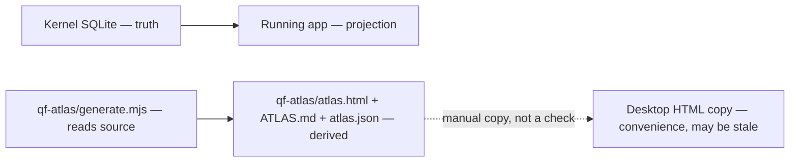

# Atlas Finish Line - Plan

## Goal Capsule

- **Objective:** Keep the wiring map honest and regenerable so an agent can tell broken from leftover from useful, then stop. Do not strip the repo. Do not start a second product.
- **Product authority:** `docs/orders/NEXT.md` still owns QuantFlow. This contract governs the atlas as a side artifact only. It does not authorize R16 work, CI edits, or deletes.
- **Open blockers:** The cheap honesty repair is on `atlas-generator` and is not accepted. A third party must re-check typed-brace hop 4, `--check`, and falsifier 26. Hop-4 severity inflation is documented as a permanent floor, not fixed in Atlas A. Neither the operator nor Cursor may sign acceptance.
- **Stop:** Atlas done means the map is honest enough to use as a floor, and can be regenerated. Atlas done does not mean leftover IPC, review SQL, or close-kill paths are gone.

## Product Contract

### Summary

Finish the atlas at Atlas A plus stay-current: a generated map an agent reads, a proposal of what is broken vs leftover vs keep, and a stop. Independent re-check of `d76c7d9` is complete. The two lies that rejected `995ed8f` and `30590ea` are gone. The operator required a cheap honesty repair before Atlas A may be called done: hop 4 must not say `read-only` when coverage is partial, the banner must name HEAD, and a typed-brace falsifier must exist. Without a real parser, the confirmed-violation count remains a floor.

### Problem Frame

The first atlas receipt claimed a clean 14/14. Independent review showed silence where a domain write existed, so a miss read as clean. Signing Atlas A on the builder's word repeats that pattern.

A second failure mode is a number that looks total. Coverage gaps already undercount. The analyzer's reachability model undercounts too. Hop 4, coverage, and persistence can disagree. A reader in three months who treats "14 confirmed" as "14 total" will plan deletes from a floor.

A third failure mode is a second source of truth. A Desktop HTML copy with no generator and no `--check` looks authoritative while it is stale. Merging `atlas-generator` onto `main` as a branch merge would land the R16-lineage product stack with it. The map would then either die quietly on an unmerged branch or contaminate trunk.

### Key Decisions

**Propose, don't delete.** The atlas names broken vs leftover vs keep. An agent reading it stops at the proposal. Deletes happen only under a real QuantFlow order.

**Atlas done ≠ repo stripped.** Dirt stays until R16 or a later order owns it. Closing this side task does not require a smaller tree.

**Atlas A plus stay-current is the finish line.** Atlas B (a real TypeScript parser) and Atlas C (baseline ratchet, CI law, enforced deletes) are out of this product. Remaining analyzer limits are accepted as a floor, not a promise to fix later inside this contract, except where hop 4 calls a write read-only.

**Independent re-check of `d76c7d9` has landed. The operator required a cheap honesty repair, not Atlas B.** `--check` was current. 25/25 falsifiers passed. Untyped `INSERT OR IGNORE` is now a confirmed write. Same-named app `insertArtifact` no longer inherits Kernel governance. Hop 4 can still say `read-only` when a `{` in a TypeScript parameter type hid the SQL. That label is in this product to fix. Teaching the atlas to parse TypeScript is still out.

**Confirmed count is a floor.** Coverage gaps can hide writes. The reachability model can hide writes. Transport exemption can miss a queue table created outside the listed files. SQL built by concatenation or held in a variable is gray in coverage and absent from persistence. A `{` in a TypeScript parameter type can steal a function body, drop SQL from persistence, and let hop 4 say read-only. "N confirmed" never means "N total."

**Same-file hop is the last widening this contract allows.** `d76c7d9` marks a same-file hop from an app-reachable name as a bypass (`kernel.ts` → `requestGovernedReview` → `createReviewTask`). A three-file chain (app → helper in another file → write) stays gray. Do not widen the model further to make findings disappear.

**Hop 4 reports reachability, not severity.** A wire marked `cheats` at hop 4 means the handler path reaches a function the index flags as holding SQL outside the write door. It does not distinguish idempotent `CREATE TABLE` on review bookkeeping tables from domain `INSERT`/`UPDATE`. The persistence classifier does. Loop health inherits wire status, so *Create a Task* can read unhealthy when the path only reaches `ensureGovernedReviewSchema` on a read — real edge, overstated label. That limit is permanent while Atlas B is out of scope.

**Loop health is not defect count.** A loop marked unhealthy means a channel on that job reaches ungoverned SQL at hop 4, not that the whole job is a product defect. Read confirmed violations for severity; read loops for wiring reachability.

**Falsifier receipts must not lie.** `falsifiers.json` is written atomically. If the receipt cannot be written after a green run, the harness exits 3. A crashed run must not leave a stale green receipt.

**Falsifiers are the product.** A generator change that drops a falsifier is a rejected change. The suite is 26 records after the cheap honesty repair. Falsifier 21 only tests the untyped `INSERT OR IGNORE` shape. Falsifier 26 is the typed-brace lock. Falsifier 23 is not a line-number proof: it matches a table token on a neighboring statement.

**`--check` is manual.** CI is out of scope. The map may be stale between manual runs, and that is accepted. The banner SHA is not allowed to name a rejected commit while `--check` is green. Regenerating so the brief names HEAD is part of the cheap honesty repair.

**Canonical picture is in-repo.** `qf-atlas/atlas.html` is the map. An operator-local Desktop copy named `QuantFlow-Atlas.html` is a disposable convenience with no generator and no `--check`. Refresh it by hand or ignore it. Never treat it as authority.

**Do not merge `atlas-generator` onto `main`.** The branch is cut from `wo-R16` and carries that product lineage. After Atlas A is independently accepted, keep generating on this branch until that lineage lands through a real product merge. Transplanting only `qf-atlas/` onto current `main` would map a different tree. Whole-branch merge is out of this contract.

### Actors

- A1. Operator — reads the HTML map, decides whether Atlas A is accepted, never treats a Desktop copy as live.
- A2. Builder agent — regenerates the map, adds falsifiers when a detector changes, does not mark its own SHA accepted.
- A3. Independent verifier — re-checks the SHA under test, runs the bait attacks, reports evidence, does not author the repair it is judging.
- A4. Downstream agent using the map — classifies broken vs leftover vs keep, proposes, stops.

### Requirements

**Honesty and acceptance**

- R1. Atlas A is not done on builder testimony. Independent re-check of `d76c7d9a2256d89b851db3584ec40053b93ad74c` on `atlas-generator` has landed. The operator still accepts or sends it back.
- R2. Untyped `INSERT OR IGNORE INTO` must be a confirmed write, not indexed-and-clean silence. SQL built by concatenation, or a table name in a variable, must be gray or a coverage gap, never indexed-and-clean.
- R3. Reachability stays limited and documented: same-file app hop is a bypass; a path that leaves the file can stay invisible; the model is not widened past same-file hop to erase findings.

**Analyzer floor**

- R4. Every atlas surface that prints a confirmed-violation count must state that the number is a floor, permanently, by design of the analyzer's reachability, transport, and TypeScript-body model as well as of coverage gaps.
- R5. Reachability counts direct callers plus same-file hops from an already app-reachable name. `createReviewTask` is the documented same-file case. A three-file chain is not required to show as a bypass. The why-text must not say production cannot reach a path that production does reach.
- R6. Transport exemption is `CREATE TABLE` found in a hand-kept list of peer-bus files, minus golden schema tables. A queue table created in any other file gets no exemption. This is not a parsed schema of the bus.
- R7. Hop 4 must not say `read-only` when coverage is partial. Absence of a persistence row is not clean when coverage is partial. A `{` in a parameter type that steals the function body may still hide the write from persistence; hop 4 may say `cheats` or unknown, never `read-only`.
- R8. Hop 4 `cheats` is reachability only: any SQL-flagged function on the handler path counts, including idempotent bookkeeping DDL the persistence classifier treats as compliant. Loop health inherits that label. The brief must state that an unhealthy loop is not a severity verdict.

**Stay current**

- R9. The committed map is regenerated from source by `qf-atlas/generate.mjs`. Nobody hand-edits `qf-atlas/ATLAS.md`, `qf-atlas/atlas.html`, or `qf-atlas/atlas.json`.
- R10. `node qf-atlas/generate.mjs --check` (or `bun qf-atlas/generate.mjs --check`) is the drift check. With CI out of scope, nothing runs it unless an operator or agent does. Stale committed files between those runs are accepted.
- R11. The generated banner must name the SHA of the tree it was produced from. A green `--check` whose brief still titles a rejected commit is not current enough for a human reader.
- R12. The falsifier suite in `qf-atlas/falsify.mjs` is a deliverable. `node qf-atlas/falsify.mjs` must stay green. Removing or skipping a falsifier to land a generator change is a rejected change. Falsifier 26 is the typed-brace lock. The harness writes `falsifiers.json` atomically and exits 3 if the receipt cannot be written after tests pass.

**How the map is used**

- R13. An agent given the atlas identifies broken vs leftover vs useful, writes that proposal, and stops. The atlas does not delete product code.
- R14. `qf-atlas/atlas.html` is the only authoritative human picture. A Desktop copy is disposable convenience, refreshed manually or ignored.
- R15. Regeneration happens on `atlas-generator` (the tree the map describes). This contract does not merge that branch to `main`.
- R16. Loop health flags reachability of ungoverned SQL at hop 4, not severity. "N of 8 unhealthy" is not N product defects.

### Key Flows

- F1. Independent accept of Atlas A
  - **Trigger:** Builder claims a repair SHA.
  - **Actors:** A2, A3, A1
  - **Steps:** Verifier checks out the named SHA; runs `--check` and the falsifier suite; re-runs the `INSERT OR IGNORE` fixture, including a typed `{` parameter shape; tries concatenation or a variable table name; confirms reachability is still limited and documented; restores every fixture; reports evidence. Operator accepts under the floor or sends it back.
  - **Outcome:** Atlas A is accepted only after that report and the operator's call, never from the builder's commit message.
  - **Covered by:** R1, R2, R3, R7, R8, R12

- F2. Stay current
  - **Trigger:** Source on `atlas-generator` moved.
  - **Actors:** A2, A1
  - **Steps:** Run the generator so the banner names this SHA; commit the three outputs with the generator change; run `--check`; run the falsifier suite. If a detector changed, add a falsifier first.
  - **Outcome:** The committed map matches this tree as of the last manual run. It may be stale until then. The banner matches HEAD.
  - **Covered by:** R9, R10, R11, R12, R15

- F3. Agent reads the map
  - **Trigger:** Operator asks what is broken, leftover, or useful.
  - **Actors:** A4, A1
  - **Steps:** Agent reads `qf-atlas/ATLAS.md` / `qf-atlas/atlas.html` from the repo, not a Desktop copy. It names candidates. It does not delete. It states that confirmed counts are a floor, that hop 4 is reachability not severity, and that loop health is not defect count.
  - **Outcome:** A proposal. The repo is unchanged aside from the proposal itself.
  - **Covered by:** R4, R7, R8, R13, R16

### Acceptance Examples

- AE1. Signing done on builder word
  - **Covers:** R1
  - **Given:** `d76c7d9` exists, `--check` is green, and 26/26 falsifiers pass in the builder's tree.
  - **When:** Someone writes "Atlas A is done" with no independent report, or treats that report as self-acceptance.
  - **Then:** The claim is rejected.

- AE2. Unhandled SQL shape
  - **Covers:** R2, R4
  - **Given:** A fixture writes domain SQL by concatenating `"INSERT INTO " + table` or by holding the table name in a variable.
  - **When:** The classifier runs.
  - **Then:** The file is gray or a coverage gap, never indexed-and-clean. Persistence may have no row. The confirmed count does not include it, and the map still says the count is a floor.

- AE3. Three-file caller still invisible
  - **Covers:** R3, R5
  - **Given:** App code in file A calls `helper` in file C, and `helper` calls `writeFn` in file B that inserts into `mission`.
  - **When:** Reachability is computed.
  - **Then:** `writeFn` may stay gray (`kernel-internal` / unknown). The why-text must not claim production cannot reach it.

- AE4. Dropped falsifier
  - **Covers:** R12
  - **Given:** A generator change makes falsifier 21 fail, and the patch deletes or skips that record.
  - **When:** The change is offered.
  - **Then:** It is rejected. The detector is fixed or a replacement falsifier of equal force is added in the same change.

- AE5. Stale Desktop copy
  - **Covers:** R14
  - **Given:** The Desktop HTML is several commits behind `qf-atlas/atlas.html`.
  - **When:** An agent or operator needs the map.
  - **Then:** They open `qf-atlas/atlas.html`. The Desktop file is ignored or overwritten by a manual copy. It is never cited as current.

- AE6. Typed brace steals the body
  - **Covers:** R2, R7
  - **Given:** An already-indexed file has `function seed(db: { x: string })` and `INSERT OR IGNORE INTO mission` in the body.
  - **When:** The classifier and hop 4 run.
  - **Then:** Coverage is partial, not indexed-and-clean. Hop 4 is not `read-only`. Persistence may have no row.

- AE7. Banner names a rejected SHA
  - **Covers:** R11
  - **Given:** HEAD is `d76c7d9` and `--check` is green.
  - **When:** A human reads `ATLAS.md`.
  - **Then:** The banner names `d76c7d9`, not `30590ea`.

- AE8. Loop health vs severity
  - **Covers:** R8, R16
  - **Given:** `qf:tasks:create` reaches `ensureGovernedReviewSchema` through the task-surface projection path, and hop 4 marks the wire `cheats`.
  - **When:** An agent reads loop health and the confirmed-violations table.
  - **Then:** The loop may read unhealthy. The brief must not treat that alone as "Create a Task is a product defect." Severity comes from persistence rows, not hop 4 alone.

### Success Criteria

- The independent re-check of `d76c7d9` has landed. Atlas A is still not done until a third party re-checks the cheap honesty repair and the operator accepts under the documented floor.
- After that, success is: an agent can regenerate the map, `--check` matches when run, the banner names HEAD, the falsifier suite passes including falsifier 26, hop 4 is not `read-only` on a typed-brace miss, receipts write atomically, and a proposal-don't-delete read of the map is possible without anyone stripping the repo.
- Success is not: baseline.json, `qa/run.ts` wiring, a full parser, or a smaller product tree.

### Scope Boundaries

**In this product**

- Honest-enough generated map (Atlas A) plus manual regeneration.
- Falsifier suite as a kept deliverable.
- Documented analyzer floor: reachability (direct callers plus same-file hop), transport file list, hop-4 reachability-not-severity, typed-brace body steal, loop health caveat, receipt atomicity.
- Propose-don't-delete use of the map.
- Canonical in-repo HTML; Desktop copy as convenience only.
- Stay on `atlas-generator` for regeneration.
- Cheap honesty repair: hop 4 not `read-only` on partial coverage, banner SHA matching HEAD, typed-brace falsifier.

**Deferred for later**

- Atlas B: real TypeScript parser, cross-file reachability, concatenated SQL as confirmed writes, transport as a parsed bus schema, typed parameter lists that do not steal function bodies, hop 4 severity aligned with persistence.
- Atlas C: seed `baseline.json`, wire `--check` into CI / `qa/run.ts`, delete leftover IPC, rewrite review SQL, close-kill.

**Outside this product's identity**

- Using the map as CI law.
- Deleting product code because the atlas listed it.
- Merging `atlas-generator` onto `main` as a substitute for the R16 product merge.
- A second authoritative HTML outside `qf-atlas/`.
- Changing `docs/orders/NEXT.md`, `docs/orders/WO-R16.md`, or `qa/run.ts` under this contract.

### Dependencies / Assumptions

- QuantFlow remains research-and-advisor only. The atlas does not place or automate a bet.
- Kernel `execute()` remains the only write path that counts as truth. The atlas is a projection of source, like `qf-kernel-schema/golden/`.
- The operator will run `--check` and the falsifier suite when the tree moves, or accept staleness until then.
- Independent re-check of `d76c7d9` landed 2026-08-17. Cheap honesty repair and receipt atomicity are in the working tree pending commit. Confirmed violations 15 (all `governed-review.ts`), gray 3, coverage gaps 27, falsifiers 26/26 with atomic receipt write.

### Outstanding Questions

**Resolve Before Planning**

- Third-party independent re-check of the post-repair tree: typed-brace attack, `--check`, falsifier 26, receipt exit code. Neither the operator nor Cursor may be verifier.

**Deferred to Planning**

- None. Hop-4 severity alignment with persistence is Atlas B, documented as R8 permanent floor.

### Sources / Research

- Branch `atlas-generator`, SHA under test `d76c7d9a2256d89b851db3584ec40053b93ad74c`, atlas range `984986d..d76c7d9`.
- Commands: `node qf-atlas/generate.mjs --check`, `node qf-atlas/falsify.mjs` (26 records; exit 3 if receipt write fails).
- Analyzer limits: `classify.mjs` (`callersOf`, `appReachableKeys`, `transportTables`, reachability order); `hop4.mjs` (`classify` reachability-only `cheats`, `functionBody` typed-brace skip); `falsify.mjs` atomic receipt.
- Hop-4 severity example: `qf:tasks:create` → `trustedActorForTile` → `kernelListTaskSurface` → `kernelGovernedReviewProjection` → `governedReviewProjection` → `ensureGovernedReviewSchema` (`CREATE TABLE qf_review_*`) — real path, overstated `cheats` label at loop level.
- Plan artifact: `docs/plans/2026-08-16-001-feat-atlas-finish-line-plan.md` is tracked via `!docs/plans/**` in `.gitignore`.
