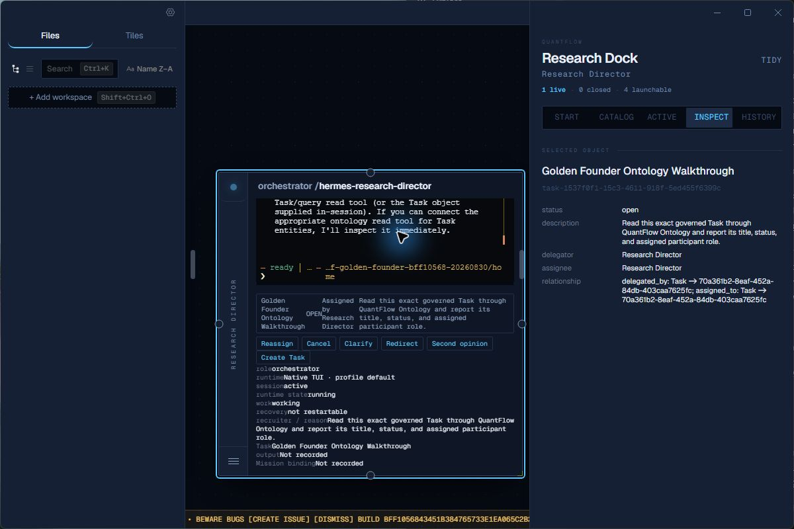

# Golden founder walkthrough — RED 01

Date: 2026-08-30 (America/Los_Angeles)  
Execution source: `bff1056843451b384765733e1ea065c2b2b910f4`  
Execution tree: `4ee183e60cac7e19b4dfbe4d565f54f06e0c37ad`  
Packaged executable: `collab-electron/dist/win-unpacked/QuantFlow.exe`  
Isolated root: `C:\tmp\qf-golden-founder-bff10568-20260830`

## Founder journey exercised

Router-owned Computer Use opened the visible packaged application, used `TIDY`, pointer-clicked the Dock's Research Director spawn control, created the Task **Golden Founder Ontology Walkthrough** through the rendered Task form, inspected that exact Task through the rendered Dock, resized the participant tile from its visible southeast handle, focused the real Hermes TUI, typed the frozen founder prompt, and pressed Enter through the visible terminal.

The Task form collapsed after creation. Canvas and Dock displayed the same Research Director participant. Inspect displayed the exact Task title, `open` status, description, delegator, assignee, and `delegated_by` / `assigned_to` relationships.

## Exact RED conjunct

The real Hermes turn could not invoke a QuantFlow Task read because the admitted orchestrator tool surface did not contain `qf_task_query` or its lineage traversal. Hermes invoked the real `qf_agent_definition_query` tool, then truthfully reported that no Task/query read tool was connected. The response included the requested marker, but the marker is rejected as evidence because the governed Task was not read.

This is a product-semantic RED, not a provider, transport, synthetic-responder, prompt-submission, or cleanup failure.

## Kernel truth created by the UI

- Task id: `task-1537f0f1-15c3-4611-918f-5ed455f6399c`
- Title: `Golden Founder Ontology Walkthrough`
- Status: `open`
- Assigned session: `70a361b2-8eaf-452a-84db-403caa7625fc`
- Delegating session: `70a361b2-8eaf-452a-84db-403caa7625fc`
- Session label: `hermes-research-director`
- Kernel database SHA-256: `7C7900288B63961DF59A59211B316CEFE759E0F759F039E150B019B27FD88FA0`

The Kernel was queried read-only only after the visible interaction had created the state.

## Trusted Hermes execution evidence

- Provider: `opencode-go`
- Model: `kimi-k3`
- Intended conversation turns: `1`
- Provider API calls inside that tool-using turn: `2` (tool request, then final response)
- Call 1: input `1442`, output `1855`, total `3297`, latency `46.9s`
- Tool: `qf_agent_definition_query`, success, latency `0.02s`
- Call 2: input `3732`, output `755`, total `4487`, latency `20.9s`
- Final reason: `text_response`, stop reason `stop`
- Synthetic responder: absent
- Fallback provider/model: absent
- Unrelated retry: absent
- Provider request id: `not_exposed`

Evidence hashes:

- Hermes `agent.log`: `FDB520D9B3BF3B965D71782BEC3ECECA18FDDBED92386ADCAC416840869F27E0`
- Hermes session JSON: `6A4FC404E854AE9210D1EDA005E16EFE037375F28B18A4FF410DEA77A260D5A6`
- QuantFlow trajectory artifact: `20B959D65D4398B6CF579558F14E328E7A8909DEACFC17FE0F310CC948AEFC4F`
- Rendered failure screenshot: `93002DB7B061EB2AAF382060C87DB8D9482324353BE510E90ED5D6AF662A51E3`

The trajectory artifact proves a real QuantFlow MCP call, but only for agent-definition query; it does not satisfy the Task-read requirement.

## Visible failure

## Lifecycle and containment

QuantFlow was closed through its visible window. The QuantFlow window disappeared from the desktop application list and a post-close Windows process census found zero `QuantFlow`, Electron, Hermes, OpenCode, or PTY-sidecar processes. The isolated failure root is intentionally preserved pending bounded repair and retry; founder state was never touched.

No credentials or credential-bearing files were read or copied into this receipt.

## Required disposition

Do not rerun the provider call until a fresh semantic Reader establishes the smallest lawful read-only orchestrator surface that can prove:

`Task title/status -> assigned_to/delegated_by -> exact AgentSession -> spawned_from -> exact AgentDefinition role`

Any repair must expose existing generated Kernel read tools only. It may not add a new truth store, bypass `execute()`, fabricate lineage, broaden write authority, or begin R18.
