# How QuantFlow runs

> Generated from `atlas-strip-1 @ 45a510e` on 2026-08-17 by
> `qf-atlas/generate.mjs`. **A projection of the code** — not Kernel truth, not the
> running app, not a place to store anything. The Kernel still owns Missions, Tasks,
> Runs, Artifacts and Evaluations. Do not hand-edit; run the generator.

## Where this repo stands

**46 of 51 findings have not been looked at.**

That is the number to drive to zero — not the number of findings. Some gaps cannot be
parsed without a compiler, and some debt is deliberate, so zero findings is not
reachable. Zero *unlooked-at* is. Record a verdict in `qf-atlas/decisions.json` and a
finding stops being undecided. Add debt and the number goes back up.

| Verdict | Count |
|---|---:|
| `undecided` | 46 |
| `repair` | 3 |
| `remove` | 0 |
| `keep` | 2 |
| `accepted` | 0 |

**Not all clear.** 46 findings still need a decision.

## The four hops

QuantFlow is an Electron research console. Every operator action crosses four hops,
and it can die or cheat at any one of them:

```mermaid
flowchart TD
  R["<b>1 · renderer</b><br/>29 surface subsystems<br/>calls a bridge method"]
  P["<b>2 · preload</b><br/>3 bridges · 127 methods<br/>113 of them called"]
  M["<b>3 · main</b><br/>123 IPC channels<br/>105 live · 13 unused · 0 dead"]
  H{"<b>4 · is it governed?</b>"}
  E["<b>execute&#40;&#41;</b><br/>the only sanctioned write"]
  DB[("<b>Kernel truth</b><br/>domain tables<br/>golden schema")]

  R --> P --> M --> H
  H -->|"write-door 14"| E
  E --> DB
  X["<b>raw SQL</b><br/>never enters a<br/>governed action"]
  H -->|"cheats 6"| X
  FS["<b>filesystem</b><br/>never reaches<br/>the Kernel"]
  H -->|"writes-disk 9"| FS
  RO["<b>read-only</b><br/>no mutation seen"]
  H -->|"read-only 94"| RO
  X -.->|"ungoverned — this is the breach"| DB

  QA["<b>QA · governance</b><br/>13 subsystems<br/>asserts the rules above"]
  SP["<b>Species · runtimes</b><br/>3 subsystems<br/>launched by path,<br/>not imported"]
  SC["<b>Schema · generated contract</b><br/>5 subsystems<br/>generated, never hand-edited"]
  QA -.->|"gates"| H
  SC -.->|"defines the tables"| DB
  SP -.->|"drives the UI as an operator would"| R

  classDef good fill:#0b3d2e,stroke:#1f9d6b,color:#e8fff5
  classDef bad fill:#4a1220,stroke:#e5484d,color:#ffe8ea
  classDef gray fill:#2a2a2e,stroke:#6b6b73,color:#e6e6ea
  classDef truth fill:#10243d,stroke:#3b82f6,color:#e6f0ff
  class E,RO good
  class X,FS bad
  class QA,SP,SC gray
  class DB,R,P,M,H truth
```



Green is governed, red is not, **gray is unmeasured — which this map may never report
as clean.** The same model renders interactively in `qf-atlas/atlas.html`.

```
1 renderer      a window surface calls a bridge method       shellApi.createTask()
2 preload       the contextBridge forwards a named channel   ipcRenderer.invoke("qf:tasks:create")
3 main          a handler receives it                        ipcMain.handle("qf:tasks:create")
4 Kernel        the handler reaches the write door           execute(db, "create_task", …)
```

Hops 1–3 answer *can the work get there*. **Hop 4 answers whether it is governed**,
and it is the one that matters: `START_HERE §1` says the Kernel owns truth, so a
handler that mutates state without `execute()` is cheating even when it works.

| At hop 4 the handler… | | Count |
|---|---|---:|
| `write-door` | reaches `execute()`, the sole sanctioned mutation path | 14 |
| `cheats` | reaches SQL that never passes through `execute()` | 6 |
| `writes-disk` | writes a file; never reaches the Kernel at all | 9 |
| `unknown` | handler file not fully read; not claimed read-only | 0 |
| `read-only` | no mutation seen | 94 |

### Broken at hop 1 (1)

A window calls a bridge method the preload **does not expose**. This throws
`TypeError: … is not a function` the moment the code path runs. It is invisible to
every other check here: the channel is registered in main, the preload is healthy, and
the loop reads green — because nothing was asking whether the method on the calling end
exists.

| Method | Called from | Exists in preload |
|---|---|---|
| `ptyForegroundProcess` | `collab-electron/src/windows/terminal/src/App.tsx:202` | **no** |

These are **product defects, not map findings** — fix the call site or restore the
method. Removing the call site is only correct if the feature is genuinely gone.

> Detection is deliberately biased toward silence: a name appearing as a key anywhere
> in a preload file counts as declared, type annotations included. A missed break is
> recoverable; a false accusation gets working code deleted.

**43 bridge methods exist but could not be paired to a channel.**
Almost all are `on*`/`off*` event subscribers, and they are unpaired for a structural
reason, not a parsing one — see the next paragraph.

### The push direction — main → renderer (47 channels)

Everything above traces **renderer → main**. The main process also pushes the other
way, and that direction runs on two layers — the second is a tunnel:

```
direct     main --webContents.send(ch)--------------> ipcRenderer.on(ch)   in a preload
tunnelled  main --send("shell:forward", target, inner)--> shell preload
                --> shell renderer dispatcher --> <webview>.send(inner)
                --> ipcRenderer.on(inner)         in universal.ts
```

| Status | Count | Meaning |
|---|---:|---|
| `live` | 34 | a send site and a preload listener |
| `renderer-terminated` | 2 | consumed by the shell dispatcher; no preload listener expected |
| `renderer-originated` | 5 | sent by the shell renderer into a webview, not by main |
| `dynamic-sender` | 3 | a template-literal channel shares this prefix — **coverage boundary, not debt** |
| `tunnel` | 1 | `shell:forward` itself, the transport |
| **`no-sender`** | **2** | **a preload subscribes and nothing sends it** |
| **`no-listener`** | **0** | **main pushes it and nothing receives** |

14 channels travel inside the tunnel. Resolving it matters: a regex that
matches only `webContents.send("literal")` sees `"shell:forward"` and misses every
inner name — and those inner names are exactly the ones that then look like orphan
listeners. That single mistake would have produced 14 false deletes.

#### `no-sender` (2)

- `cd-to` — `collab-electron/src/preload/universal.ts:98` · **INVESTIGATE**
  - a preload subscribes and no send site was found in main or the renderer; verify no dynamic producer before removing
- `shell:loading-status` — `collab-electron/src/preload/shell.ts:172` · **INVESTIGATE**
  - a preload subscribes and no send site was found in main or the renderer; verify no dynamic producer before removing

**Confidence is `medium` on every row here, and the disposition is `INVESTIGATE`, never
`REMOVE`.** These patterns are textual, and text may not create a high-confidence
architectural red on its own — promoting any of this to a confirmed defect requires the
AST pass. 7 send sites build their channel or target
dynamically and are recorded as explicit coverage boundaries rather than omitted.

## The product loop

`ASK PLAN RECRUIT ASSIGN WATCH STEER PUBLISH REVIEW REOPEN LEARN CLOSE`

Every loop carries **four independent evidence tiers**. They are never averaged, and a
badge is not a score:

| | |
|---|---|
| `S` static | the wiring exists and reaches `execute()` on every channel |
| `G` gate | a focused QA gate covering this loop is present in the repo |
| `R` runtime | the loop was observed executing |
| `F` founder | the founder has confirmed it does its job |

**`S` alone is not `SGRF`.** 7 of 11 loops are statically connected; 0 carry all four tiers.

| Loop | Badge | Static | Gate | Runtime | Founder |
|---|---|---|---|---|---|
| **ASK** | `SG` | connected | covered | unproven | unproven |
| **PLAN** | `G` | broken | covered | unproven | unproven |
| **RECRUIT** | `SG` | connected | covered | unproven | unproven |
| **ASSIGN** | `G` | broken | covered | unproven | unproven |
| **WATCH** | `SG` | connected | covered | unproven | unproven |
| **STEER** | `SG` | connected | covered | unproven | unproven |
| **PUBLISH** | `SG` | connected | covered | unproven | unproven |
| **REVIEW** | `G` | broken | covered | unproven | unproven |
| **REOPEN** | `SG` | connected | covered | unproven | unproven |
| **LEARN** | `SG` | connected | covered | unproven | unproven |
| **CLOSE** | `G` | degraded | covered | unproven | unproven |

Runtime and founder read `unproven` on every loop, and that is the honest state: no
runtime trace and no founder-confirmation record exist in this repo. **Unproven with a
stated reason is not a gap** — it is the difference between an unknown and a lie.

### PLAN — broken

The question is decomposed into Tasks the Kernel records.

- `qf:tasks:create` — **cheats**: reaches SQL the hop-4 walker places outside execute()

### ASSIGN — broken

A Task moves to a seat. The agent path notifies the seat; the human path is where delivery has failed before.

- `qf:tasks:surface` — **cheats**: reaches SQL the hop-4 walker places outside execute()

### REVIEW — broken

The governed critic path. R15 shipped on this, and R16 renders it.

- `qf:review:request` — **cheats**: reaches SQL the hop-4 walker places outside execute()
- `qf:review:projection` — **cheats**: reaches SQL the hop-4 walker places outside execute()
- `qf:review:revision` — **cheats**: reaches SQL the hop-4 walker places outside execute()
- `qf:review:secondCritic` — **cheats**: reaches SQL the hop-4 walker places outside execute()

### CLOSE — degraded

Sessions and processes end cleanly, and nothing keeps running after the app closes.

- `agent:kill` — **unused**: breaks at renderer

A `gate` tier of `covered` means the nominated gate FILE is present. It never claims
the gate passed — running it is out of scope for a sub-60-second check, and asserting a
pass nobody observed is the fake green this separation exists to prevent.

## What is actually part of the product

Every other section describes what a file *does*. This one asks whether the file is
still yours. Imports are walked from the app's real entrypoints — main, both preloads,
and each window's own script — so this is a file-level graph, not a call graph.

| | Files | Meaning |
|---|---:|---|
| `entrypoint` | 18 | the app starts here |
| `reachable` | 206 | imported from an entrypoint |
| `process-entry` | 0 | launched by path, not imported (workers) |
| `package-entry` | 2 | named in a workspace package's exports |
| `test-only` | 2 | reached only from tests |
| **`unreachable`** | **6** | **nothing imports it — start here** |

### Unreachable (6) — ask the founder, do not delete

Nothing in the product imports these. **`unreachable` is a question, not a verdict.**
Two different situations produce byte-for-byte identical evidence:

| | Looks like | Correct action |
|---|---|---|
| **built ahead of the UI** | unreachable | keep — the caller is a future rung |
| **abandoned** | unreachable | remove |

The code does not record which one it is. Neither does the git history, and neither
would runtime tracing — code built ahead of its UI never executes either, so a trace
marks it dead exactly like real corpse code. **Intent is not recoverable from the
repository.** The only source is the founder, and the only place to put the answer is a
verdict in `qf-atlas/decisions.json`.

> This section exists because an agent reading this map proposed deleting the `a2a-*`
> modules as "a fossil". They are agent-to-agent collaboration — the founding concept
> of the project, named as a plane in `README.md`. The map was right that nothing
> imports them. The inference drawn from that was wrong, and no amount of further
> static analysis would have prevented it.

Before proposing removal of anything below, rule out: workspace package exports,
dynamic `import()`, path-launched processes, packaging manifests, and QA gates that
assert the file exists. Then ask.

- `collab-electron/src/main/a2a-bus.ts`
- `collab-electron/src/main/a2a-orchestra.ts`
- `collab-electron/src/main/species-launch.ts`
- `collab-electron/src/main/species-surface.ts`
- `collab-electron/src/main/species-tools.ts`
- `collab-electron/src/windows/shared/flow-cube/cube3d.js`

## What to remove

Three buckets, because they call for three different actions. **Do not treat these as
one list.**

### Broken now — fix or remove (0)

_these fail at runtime today_

None.

### Removal candidate — static evidence only (0)

_registered in main, no static caller found; needs package + dynamic-caller proof before deletion_

None.

### Maybe later — do NOT delete on sight (13)

_works end to end, but nothing calls it yet_

> `qf:review:projection` is in this bucket and is exactly what R16 needs to render
> the Evaluation tile. Deleting this bucket wholesale would remove the next rung.

- `agentKill() → agent:kill` — collab-electron/src/preload/universal.ts:695
- `openFolder() → dialog:open-folder` — collab-electron/src/preload/universal.ts:454
- `openImageDialog() → dialog:open-image` — collab-electron/src/preload/universal.ts:317
- `countFiles() → fs:count-files` — collab-electron/src/preload/universal.ts:270
- `getHomePath() → get-home-path` — collab-electron/src/preload/shell.ts:311
- `deleteConnectionsForTile() → qf:connections:deleteForTile` — collab-electron/src/preload/shell.ts:122
- `getGovernedReviewProjection() → qf:review:projection` — collab-electron/src/preload/shell.ts:85
- `permissionDecision() → qf:sessions:permissionDecision` — collab-electron/src/preload/universal.ts:167
- `openSettings() → settings:open` — collab-electron/src/preload/shell.ts:212
- `openExternal() → shell:open-external` — collab-electron/src/preload/shell.ts:305
- `runInTerminal() → viewer:run-in-terminal` — collab-electron/src/preload/universal.ts:290
- `workspaceRemove() → workspace:remove` — collab-electron/src/preload/shell.ts:256
- `updateFrontmatter() → workspace:update-frontmatter` — collab-electron/src/preload/universal.ts:326

## Write-door violations

The declared write door is `execute.ts`, `create.ts`, `insert.ts`, `events.ts`,
`db.ts`, `upgrade.ts`, plus generated schema SQL. Any other file holding SQL appears
here automatically, so a new one cannot arrive quietly.

The question is not "does this file contain INSERT". It is **can production domain
state reach this SQL without first entering a governed action?** Domain tables come
from the generated schema; reachability follows call sites and the Kernel command table.

**15 confirmed**, 2 unknown (gray — not counted as debt).

| File | Table | Verb | Kind | Reach | Confidence |
|---|---|---|---|---|---|
| `packages/qf-kernel/src/governed-review.ts` | `links` | INSERT INTO | domain-truth | bypass | high |
| `packages/qf-kernel/src/governed-review.ts` | `qf_review_attempt` | CREATE TABLE | non-domain-store | bypass | medium |
| `packages/qf-kernel/src/governed-review.ts` | `qf_review_attempt` | INSERT INTO | non-domain-store | bypass | medium |
| `packages/qf-kernel/src/governed-review.ts` | `qf_review_invocation` | CREATE TABLE | non-domain-store | bypass | medium |
| `packages/qf-kernel/src/governed-review.ts` | `qf_review_invocation` | INSERT INTO | non-domain-store | bypass | medium |
| `packages/qf-kernel/src/governed-review.ts` | `qf_review_publication` | CREATE TABLE | non-domain-store | bypass | medium |
| `packages/qf-kernel/src/governed-review.ts` | `qf_review_receipt` | CREATE TABLE | non-domain-store | bypass | medium |
| `packages/qf-kernel/src/governed-review.ts` | `qf_review_receipt` | INSERT INTO | non-domain-store | bypass | medium |
| `packages/qf-kernel/src/governed-review.ts` | `qf_review_source_work` | CREATE TABLE | non-domain-store | bypass | medium |
| `packages/qf-kernel/src/governed-review.ts` | `qf_review_source_work` | INSERT INTO | non-domain-store | bypass | medium |
| `packages/qf-kernel/src/governed-review.ts` | `qf_review_task` | CREATE TABLE | non-domain-store | bypass | medium |
| `packages/qf-kernel/src/governed-review.ts` | `qf_review_task` | INSERT INTO | non-domain-store | bypass | medium |
| `packages/qf-kernel/src/governed-review.ts` | `qf_review_task` | UPDATE | non-domain-store | bypass | medium |
| `packages/qf-kernel/src/governed-review.ts` | `task` | INSERT INTO | domain-truth | bypass | high |
| `packages/qf-kernel/src/governed-review.ts` | `task` | UPDATE | domain-truth | bypass | high |

### Before you edit these

Everything that imports the file, directly or transitively. This is what breaks if the
change is wrong. **`atlas.json` carries this for every file** — 232 of
234 — not only the ones carrying a finding, because the question is
asked before the change, when nothing is red yet.

`packages/qf-kernel/src/governed-review.ts` — **40 files depend on it**, it imports 5

```
  packages/qf-kernel/src/index.ts
  packages/qf-kernel/src/portable.ts
  packages/qf-kernel/src/create.ts
  qa/gates/agent-path/run.ts
  qa/gates/artifact-root/run.ts
  qa/gates/boot-reconcile/run.ts
  qa/gates/bovada-football/run.ts
  qa/gates/dock-definition-launch/run.ts
  qa/gates/dock-profile-identity/run.ts
  qa/gates/dock-registry/run.ts
  …30 more
```

### Blast-radius coverage

**232 of 234 files** carry a blast radius in `atlas.json`. The rest have
no dependents, no dependencies and no wires, so there is nothing to report for them.

Most-depended-on files — change these last:

| File | Dependents | Imports | Wires |
|---|---:|---:|---:|
| `packages/qf-kernel/src/registry-drift.ts` | 54+ | 0 | 0 |
| `packages/qf-kernel/src/trace.ts` | 54+ | 1 | 0 |
| `packages/qf-kernel/src/upgrade.ts` | 54+ | 3 | 0 |
| `packages/qf-kernel/src/db.ts` | 49+ | 4 | 0 |
| `packages/qf-kernel/src/errors.ts` | 49+ | 0 | 0 |

Deliberately **not** violations, and each was reported as one before the classifier
learned the difference: transport bookkeeping (tables created by the peer-bus DDL,
which are not in the golden schema),
Kernel command implementations dispatched by `execute()`, schema migrations,
generated SQL, and QA fixture seeding.

## What the analyzer could not read (27)

**Absence of a finding is not proof of compliance.** These files hold SQL the function
indexer could not resolve, so governance analysis never saw it. They are gray, and they
prevent a clean architectural result.

| File | Coverage | SQL in text | SQL resolved |
|---|---|---:|---:|
| `packages/qf-kernel/src/upgrade.ts` | partial | 1 | 3 |
| `tools/qf-peer-bus/src/bus.ts` | partial | 4 | 0 |
| `collab-electron/src/main/kernel.ts` | partial | 7 | 6 |
| `packages/qf-kernel/src/db.ts` | partial | 1 | 0 |
| `collab-electron/src/main/env.d.ts` | unindexed | 0 | 0 |
| `collab-electron/src/main/host-acp-bridge.ts` | unindexed | 0 | 0 |
| `collab-electron/src/main/peer-role-registry.ts` | unindexed | 0 | 0 |
| `collab-electron/src/main/qf-execute-allowlist.ts` | unindexed | 0 | 0 |
| `collab-electron/src/main/sidecar/client.ts` | unindexed | 0 | 0 |
| `collab-electron/src/main/sidecar/ring-buffer.ts` | unindexed | 0 | 0 |
| `collab-electron/src/main/updater/index.ts` | unindexed | 0 | 0 |
| `collab-electron/src/main/vite-raw.d.ts` | unindexed | 0 | 0 |
| `packages/qf-kernel/src/errors.ts` | unindexed | 0 | 0 |
| `packages/qf-kernel/src/index.ts` | unindexed | 0 | 0 |
| `packages/qf-kernel/src/portable.ts` | unindexed | 0 | 0 |
| …12 more | | | see `atlas.json` |

> `governed-review.ts` is in this table. The confirmed-violation count above is
> therefore a **floor**, not a total — it was computed from a partial read of the very
> file the finding concerns.

## Protocol variants (2)

Electron runs two protocols on one channel name: `ipcMain.on` receives
`ipcRenderer.send`, `ipcMain.handle` answers `ipcRenderer.invoke`. They do not
overwrite each other, so registering both is **not** duplicate ownership.

| Channel | Registered | Called via | Unused variant | Disposition |
|---|---|---|---|---|
| `pty:write` | invoke + send | send | invoke | **investigate** |
| `pty:send-raw-keys` | invoke + send | send | invoke | **investigate** |

`investigate` is not `delete`: a packaged or dynamically-loaded caller must be ruled
out before the unused variant can be removed.

## Who owns what (6 contested of 10)

Duplicate ownership is bigger than duplicate IPC registration. The duplicate detector
catches two handlers on one channel; it cannot catch the failure this repo actually
has — **old code left alive beside new code, under a different name, on a different**
**channel, doing the same job.**

The responsibility list is an explicit architectural *policy*. It declares which jobs
are canonical; it does not decide who implements them — every claimant below is
discovered from the AST.

| Responsibility | Claimants | Structural | Confidence |
|---|---:|---:|---|
| Session lifecycle | 5 | 2 | high |
| Runtime launch / admission | 3 | 0 | medium |
| Exact task delivery | 5 | 3 | high |
| Layout / cache persistence | 0 | 0 | — *unclaimed* |
| Process cleanup | 4 | 0 | medium |
| Research review / publication | 6 | 2 | high |
| Artifact storage | 7 | 3 | high |

### Session lifecycle

2 files carry STRUCTURAL evidence for one responsibility — they mutate the same table or own the same channel family, which is competing ownership rather than a shared helper

- **collab-electron/src/main/host-acp-permission.ts** — ipcMain.handle("qf:sessions:permissionDecision") at line 54
- **packages/qf-kernel/src/create.ts** — INSERT INTO agent_session at line 571
- `collab-electron/src/main/agent-host.ts` — exports startPrecreatedNativeTuiSession() at line 546
- `collab-electron/src/main/host-native-tui.ts` — exports cancelNativeTuiSession() at line 392
- `collab-electron/src/main/kernel.ts` — exports kernelAssertSessionMayClose() at line 479

### Exact task delivery

3 files carry STRUCTURAL evidence for one responsibility — they mutate the same table or own the same channel family, which is competing ownership rather than a shared helper

- **packages/qf-kernel/src/execute.ts** — UPDATE task at line 119
- **packages/qf-kernel/src/governed-review.ts** — INSERT INTO task at line 270
- **packages/qf-kernel/src/create.ts** — INSERT INTO task at line 663
- `collab-electron/src/main/kernel.ts` — exports kernelListTaskAssignments() at line 389
- `collab-electron/src/main/task-delegation-projection.ts` — exports projectTaskAssignments() at line 81

### Research review / publication

2 files carry STRUCTURAL evidence for one responsibility — they mutate the same table or own the same channel family, which is competing ownership rather than a shared helper

- **packages/qf-kernel/src/governed-review.ts** — INSERT INTO evaluation at line 471
- **packages/qf-kernel/src/create.ts** — INSERT INTO evaluation at line 1259
- `collab-electron/src/main/kernel.ts` — exports kernelRequestGovernedReview() at line 512
- `collab-electron/src/main/second-opinion-admission.ts` — exports resolveSecondOpinionAdmission() at line 6
- `packages/qf-kernel/src/creation-policy.ts` — exports requireObservedGrade() at line 38
- `packages/qf-kernel/src/execute.ts` — exports executeSecondOpinion() at line 226

### Artifact storage

3 files carry STRUCTURAL evidence for one responsibility — they mutate the same table or own the same channel family, which is competing ownership rather than a shared helper

- **packages/qf-kernel/src/create.ts** — INSERT INTO artifact at line 357
- **packages/qf-kernel/src/deterministic-execution.ts** — INSERT INTO artifact at line 500
- **packages/qf-kernel/src/governed-review.ts** — INSERT INTO artifact at line 407
- `collab-electron/src/main/a2a-artifact-store.ts` — exports createA2aArtifactStore() at line 26
- `collab-electron/src/main/agent-artifact-writer.ts` — exports writeAgentReportArtifact() at line 30
- `collab-electron/src/main/kernel.ts` — exports getArtifactRoot() at line 113
- `packages/qf-kernel/src/resolve-artifact-root.ts` — exports resolveArtifactRoot() at line 25

**`strong` is structural** — the file mutates the responsibility's table or owns its
channel family. **`weak` is a name match only**, and the contract forbids name matching
from producing a confirmed defect on its own, so a responsibility contested on weak
evidence alone reads `medium` and needs a human. Transport modules — the preloads and
the `ipc-*.ts` surface — are excluded: registering a channel is routing, not owning.

## Process lifetime

"Close does not kill the worker" never looks like a missing handler, so it needs its
own kind of wire: **spawn → reap**. A module that starts a long-lived process and is
not stopped by the quit path leaves that process running after the app closes.

| Module | Long-lived spawns | Reaped by quit |
|---|---:|---|
| `acp-agent.ts` | 1 | **no** |
| `sidecar/server.ts` | 1 | **no** |
| `tmux.ts` | 1 | **no** |
| `pty.ts` | 2 | **partial** — pty.setShuttingDown(), pty.killAllAndWait(), pty.shutdownSidecarIfIdle() |
| `git-replay.ts` | 1 | yes |
| `watcher.ts` | 1 | yes |

- `acp-agent.ts` — This module starts 1 process and the quit path never stops it. A closed seat can outlive the app.
- `sidecar/server.ts` — This module starts 1 process and the quit path never stops it. A closed seat can outlive the app.
- `tmux.ts` — This module starts 1 process and the quit path never stops it. A closed seat can outlive the app.
- `pty.ts` — Stopped by setShuttingDown, killAllAndWait, but shutdownSidecarIfIdle is conditional — that resource survives a close while busy.

## Staying true

```bash
bun qf-atlas/generate.mjs           # rewrite the map from source
bun qf-atlas/generate.mjs --check   # exit 1 if the committed map is stale
```

`--check` compares a fingerprint of the model with `branch`, `commit` and
`generatedAt` excluded, so a plain commit does not trip it but moved code does.
**The map cannot drift from its generator for longer than one commit.** Generator
correctness is a separate question, protected by the falsifiers and by independent
verification. `--check` proves the outputs match the generator; it never proves the
generator is right — this branch shipped fingerprint-current outputs that were still
reporting a disproved violation count.
